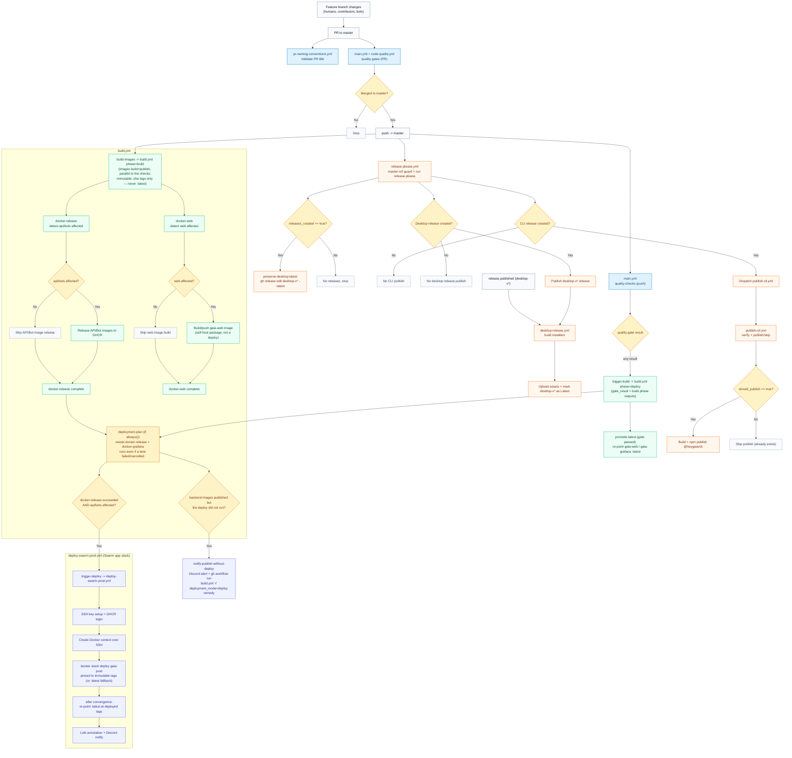

# CI and Deployment Flow

> IMPORTANT FOR AGENTS: If any workflow trigger, job dependency, deploy condition, workflow dispatch wiring, or release path changes in `.github/workflows/`, update this file in the same PR.

## End-to-End Flow Diagram

## Per-Workflow Steps
### `.github/workflows/main.yml`
1. Enter from PRs targeting `master` and pushes to `master`.
2. `detect`: validate the release manifest and compute Nx-affected Python/TypeScript project lists (fail-loud — an nx error fails the job rather than silently skipping every lane).
3. Correctness lanes, each gated on the affected lists: `build` (TS builds), `test-typescript` (vitest via Nx), `test-device-bridge` (the Node-driven e2e, its own lane so the shards can skip Node), and `test-python` — pytest sharded 6-way via pytest-split, run directly on the runner against live PostgreSQL/Redis/MongoDB/ChromaDB/RabbitMQ containers started by `scripts/ci/start-test-services.sh` (same images/credentials as the local `dagger call test-python` harness). The shards run `-p no:randomly` so collection order is identical everywhere and pytest-split's positional slices stay disjoint — per-shard random seeds left a third of the suite unrun. Each shard measures coverage with `--cov-fail-under=0`; `test-python-coverage` asserts the shards partitioned the suite (`scripts/ci/assert_shard_partition.py`), combines the shard files and enforces the repo gate (70% temporary, target 80%) plus diff-cover 90%, schemathesis, and gaia-shared tests. Static checks (ruff, mypy, Biome, tsc, custom AST lints, dead code) intentionally do NOT run here — they are enforced lanes in `code-quality.yml`.
4. `quality-gate` (branch protection target) fails on any failed/cancelled lane; skipped lanes pass.
5. On `master` pushes only, `build.yml` is called in two phases: `build-images` (`phase=build`, needs only `detect`) builds and publishes the Docker images in parallel with the test lanes — immutable `:<sha>`/version tags only, never `:latest`, and its deploy-side jobs (`deployment-plan`, orphan alert, `trigger-deploy`, `promote-latest`) are guarded off with `inputs.phase != 'build'`; then `trigger-build` (`phase=deploy`, needs `quality-gate` + `build-images`, `if: always()` so a failed gate still reaches the orphan guardrail) calls `build.yml` again with `gate_result` and the build phase's outputs to run the deploy plan, `:latest` promotion, and the Swarm deploy.

### `.github/workflows/code-quality.yml`
1. Enter from PRs targeting `master`, pushes to `master`, and manual dispatch.
2. `changes`: one cheap no-toolchain job detects which languages a PR touches; Python lanes and TypeScript lanes are skipped wholesale when their language is untouched (on push/dispatch everything runs).
3. Twenty hygiene lanes (Biome, deps, circular, file-size, types-location, components-per-file, jscpd, type-coverage, package hygiene, tsc, `python-static` = ruff + custom AST lints + xenon + interrogate + bandit + pip-audit in one job, mypy, evlog-map observability score, wide-event cross-runtime conformance, knip/vulture dead code), each self-scoping to changed files via `scripts/ci/changed-files.sh`. The Python static tools share one lane because each is seconds of work behind ~40s of runner boot + checkout + uv install; every tool step is `continue-on-error` with an aggregating verdict, so one red tool still does not hide the others. The `wide-event-conformance` lane runs the Python and TypeScript logging stacks for real and diffs the log shapes they actually emit against each other and against `scripts/ci/wide-event-conformance/contract.json`, so the two halves cannot drift apart. The observability lane (`tools/evlog_map`, enforced) posts the full-repo score to the job summary and fails PRs whose changed files score below the same files at the merge-base.

4. `Quality gate (required)` (the single required status check) fails the merge if any lane is neither `success` nor `skipped`; a lane skipped by `changes` counts as passing, but a failed `changes` job fails the gate. All lanes are enforced — there is no informational tier.

### `.github/workflows/build.yml`
0. Phase-aware entrypoints: called from main.yml as `phase=build` (image lanes only, pre-gate, immutable tags only) and `phase=deploy` (deploy plan + `:latest` promotion + Swarm deploy, fed by the build phase's outputs passed back as inputs). Manual `workflow_dispatch` / `repository_dispatch` leave `phase` empty and run the legacy single-phase flow unchanged. No job may move `:latest` in `phase=build` — the quality gate has not reported yet.
1. Start three build lanes: `docker-release`, `docker-web`, `docker-grafana` (skipped in `phase=deploy`).
2. `docker-release`: detect affected backend/bot projects, publish images to GHCR, optionally sync Discord commands. Records `images_published` right after its push steps (before Discord command sync), so a later, unrelated step failure never misreports a real publish as "nothing published". After the release steps, `scripts/ci/resolve-image-tags.sh` resolves the immutable per-commit tags nx pushed (production versionScheme `YYMM.DD.<shortsha>`, read from the local image store, never recomputed) and guarantees they exist in GHCR (pushing them if nx skipped publishing), emitting `apps_tag` (gaia + gaia-voice-agent) and `bots_tag` (the five bot images) — empty when that group wasn't released this run. Backend `:latest` is never pushed at build time: it is re-pointed exclusively by the deploy's `retag-latest-alias.sh` after convergence (":latest == deployed").
3. `docker-web`: detect `web` changes and build/push the `gaia-web` image only when affected. This is a package publish for self-host users (`docker-compose.selfhost.yml`), not a production deploy — the hosted frontend deploys via `.github/workflows/deploy-web.yml` → Cloudflare Workers (`wrangler deploy`) on every master push. In `phase=build` it pushes only `:<sha>`; `promote-latest` re-points `:latest` after the gate passes. Layer cache lives in GHCR (`gaia-web:buildcache`, zstd) — the `type=gha` export measured 449s of a 951s build.
4. `docker-grafana`: builds/pushes the Grafana image unconditionally every run (tiny COPY layer over the upstream image). Not part of orphan detection — it has no "affected" concept. Same `:latest` rule: `:<sha>` only in `phase=build`; `:latest` moves via the deploy retag or `promote-latest`.
5. `deployment-plan` runs with `if: always()` — it is never skipped by a lane failing or being cancelled — and needs `docker-release` + `docker-grafana` purely for sequencing (deploy planning must not race ahead of the build lanes). It evaluates `docker-release`'s `.result` plus backend affected-detection (`docker-release.outputs.api_affected`/`bots_affected`) via `scripts/ci/compute-deploy-plan.sh`:
   - `backend_deploy` is `true` only when `docker-release` succeeded AND api/bots affected. A failed/cancelled `docker-release` never deploys; `docker-web`'s result never gates it — the hosted frontend has already shipped itself either way.
   - `backend_orphaned` flags when backend images actually published to GHCR (`images_published` — publish evidence, not the job result) but the deploy did not run this time (lane failure, cancellation, or the plan deciding not to deploy). Scoped to `master` only, and a deploy the operator deliberately excluded via `deployment_mode=none` is never flagged — an operator choice is not drift.
   - Manual `workflow_dispatch` mode `deploy` bypasses affected-detection AND lane-result gating — the intended one-command remedy for drift: `gh workflow run build.yml --ref master -f deployment_mode=deploy` redeploys whatever is currently tagged `:latest` in GHCR regardless of what this run's own build lanes did. Manual `auto` behaves like an automatic push.
6. `notify-publish-without-deploy` fires a Discord alert when `backend_orphaned` is set, naming the published-but-undeployed images and the `gh workflow run` remedy above. All deploy-pipeline Discord sends go through `scripts/ci/notify-discord.sh` (single webhook embed; the previous appleboy action 400'd on messages over 256 chars and fragmented comma-containing ones), with `continue-on-error` on the send step only — the message is fully logged in the run either way, and a dropped webhook must not turn an otherwise-green run red.
7. Trigger `deploy-swarm-prod.yml` when `backend_deploy` is true. `trigger-deploy` passes the immutable tags through (`apps_image_tag` / `bots_image_tag` from `docker-release`, `grafana_image_tag` = the commit sha when `docker-grafana` succeeded); empty tags mean the deploy falls back to `:latest` (the manual-mode drift remedy keeps exactly its old semantics).
8. `promote-latest` (`phase=deploy`, gate passed): `scripts/ci/promote-latest.sh` re-points `:latest` for the two repos the Swarm deploy does not own — `gaia-web` (package publish) and `gaia-grafana` when no backend deploy runs to retag it — via registry-side `imagetools create`. Backend repos are deliberately absent (deploy retag owns them).

### `.github/workflows/deploy-swarm-prod.yml`
1. Install SSH private key from `PROD_VM_SSH_KEY` via the `setup-swarm-context` composite action and log in to GHCR.
2. Create Docker context pointing at the Hetzner VM over SSH.
3. Run `docker --context prod stack deploy --with-registry-auth` for the app stack (`gaia-prod`), exporting the `apps_image_tag` / `bots_image_tag` / `grafana_image_tag` inputs as `GAIA_IMAGE_TAG` / `GAIA_BOTS_IMAGE_TAG` / `GAIA_GRAFANA_IMAGE_TAG` so the stack is pinned to the exact images this run verified. Empty inputs fall through to the compose file's `${VAR:-latest}` defaults — the pre-parameterization behavior, used by manual dispatches that just want to redeploy `:latest`.
   Swarm handles rolling update; the workflow polls `gaia-backend`, `arq_worker`, and `voice-agent-worker` for convergence and fails on auto-rollback.
4. Only after convergence succeeds, `scripts/ci/retag-latest-alias.sh` re-points each deployed repo's `:latest` at the deployed tag registry-side (`docker buildx imagetools create`, no layer transfer) — `:latest` is a deploy-time alias meaning "what prod runs", not "what was last built". A failed deploy does not move `:latest`.
5. Push a deploy annotation to Loki (including the deployed tags) and send status to Discord via `scripts/ci/notify-discord.sh`.
6. Manual `workflow_dispatch` supports `action=rollback` with `rollback_mode=last` (Docker service rollback) or `rollback_mode=digest` (redeploy pinned image). After a successful rollback, the same retag script re-points `:latest` at the images the rolled-back services now run (digest mode: the pinned gaia ref; last mode: each rolled-back service's restored image spec), so the alias keeps tracking production through rollbacks too.

### `.github/workflows/deploy-web.yml`
1. Triggers on `push: master` (paths `apps/web/**`, `libs/shared/ts/**`, `wrangler.jsonc`, `open-next.config.ts`, `next.config.mjs`) and `pull_request: master` (same paths) plus manual `workflow_dispatch`.
2. `build`: checkout → `setup-node-pnpm` + `restore-nextjs-cache` + `.nx/cache` → `preflight` (best-effort Workers Builds API probe, never blocks) → `pnpm --filter ./apps/web cf:build` timed via `time` → upload `apps/web/.open-next` artifact → report duration to `$GITHUB_STEP_SUMMARY` (`::notice`) and fail visibly (`::error` + summary on failure). Concurrency `deploy-web-${{ github.ref }}` with `cancel-in-progress: false` so rapid master merges queue rather than drop the deploy.
3. `deploy-prod`: gated `if: github.ref == 'refs/heads/master' && github.event_name != 'pull_request'`, `environment: production`, downloads artifact, verifies `worker.js` exists, then `cloudflare/wrangler-action@v3` with `command: deploy --config apps/web/wrangler.jsonc`. Reports duration and success URL; fails visibly with token-scope hint on error.
4. `preview`: gated `if: github.event_name == 'pull_request'`, uploads preview version via `command: versions upload --preview-alias pr-${{ github.event.number }} --config apps/web/wrangler.jsonc`, reports duration, comments PR with expected preview URL. Requires Workers Versions / Gradual Rollouts enabled; `preview_urls: false` in `wrangler.jsonc` means the alias URL is only reachable if routing is configured.

> Workers Builds (dashboard git auto-deploy) must be **disabled** — see `docs/cloudflare-workers-builds.md` and `scripts/ci/disable-cf-builds.sh`. The workflow header comments the exact dashboard steps and the `preflight` API probe.

### `.github/workflows/release-please.yml`
1. Enforce `master` ref (manual runs on non-master fail fast).
2. Run Release Please for valid `master` executions.
3. Open/update release PRs and create component tags/releases.
4. If any releases were created (`releases_created`), run `preserve-desktop-latest`: marks the most recent `desktop-v*` release as GitHub's "Latest". This is required because electron-updater resolves updates via `/releases/latest`, and other component releases (api, web, cli) would otherwise steal the Latest flag from the desktop release, breaking auto-updates.
5. If CLI release created, dispatch `publish-cli.yml` with resolved tag/version.
6. Desktop release tags (`desktop-v*`) later trigger `desktop-release.yml` via GitHub `release.published`.

### `.github/workflows/publish-cli.yml`
1. Accept release `tag` and `version` via workflow dispatch.
2. Verify tag/version/manifests and npm idempotency (`should_publish`).
3. If publish required: build `packages/cli` and `npm publish --provenance`.
4. If version already exists: skip safely.

### `.github/workflows/desktop-release.yml`
1. Trigger on `release.published`, then continue only for `desktop-v*` tags.
2. Set desktop package version from release tag.
3. Build installers across macOS, Windows, Linux in parallel. electron-builder runs with `--publish never` to prevent it from auto-creating a separate `v*` GitHub release (it still uses `GH_TOKEN` for downloading Electron binaries without rate-limit issues).
4. Upload artifacts to the matching GitHub Release and mark it as GitHub's "Latest" (`make_latest: true`) so electron-updater can find `latest-*.yml` via `/releases/latest`.

### `.github/workflows/pr-naming-conventions.yml`
1. Trigger on PR open/edit/synchronize.
2. Validate PR title against configured semantic type list.

## File Map
- `.github/workflows/main.yml`: CI correctness gate (build + tests). Python tests run runner-native against live service containers.
- `.github/workflows/code-quality.yml`: code-hygiene lanes (lint/type/dead-code/complexity/security) behind the ratcheted `Quality gate (required)` check.
- `.github/workflows/build.yml`: Docker image build/publish via Dagger, deploy planning, and deploy triggers.
- `.github/workflows/deploy-swarm-prod.yml`: production backend deploy and rollback via Docker Swarm stack on Hetzner VM.
- `.github/workflows/deploy-web.yml`: Cloudflare Workers frontend deploy — builds `pnpm --filter ./apps/web cf:build`, deploys via `cloudflare/wrangler-action@v3` on `push: master` (paths `apps/web/**`), preview alias `pr-<n>` on PRs. Reports duration, fails visibly, uses `environment: production`. Workers Builds auto-deploy must be disabled (see `docs/cloudflare-workers-builds.md`).
- `.github/workflows/release-please.yml`: release PR/tag automation and CLI publish dispatch.
- `.github/workflows/publish-cli.yml`: CLI package validation/build/publish workflow.
- `.github/workflows/desktop-release.yml`: desktop installer build and release-asset upload.
- `.github/workflows/pr-naming-conventions.yml`: PR title convention enforcement.
