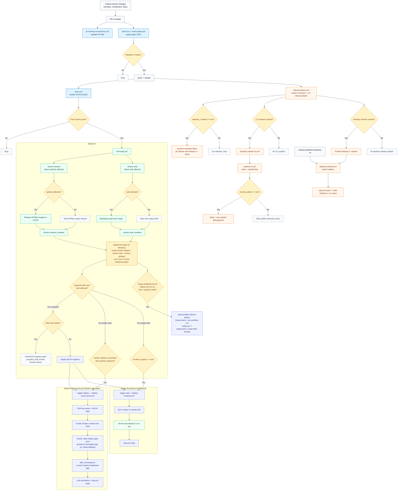

# CI and Deployment Flow

> IMPORTANT FOR AGENTS: If any workflow trigger, job dependency, deploy condition, workflow dispatch wiring, or release path changes in `.github/workflows/`, update this file in the same PR.

## End-to-End Flow Diagram

## Per-Workflow Steps
### `.github/workflows/main.yml`
1. Enter from PRs targeting `master` and pushes to `master`.
2. `detect`: validate the release manifest and compute Nx-affected Python/TypeScript project lists (fail-loud — an nx error fails the job rather than silently skipping every lane).
3. Correctness lanes, each gated on the affected lists: `build` (TS builds), `test-typescript` (vitest via Nx), and `test-python` — pytest run directly on the runner against live PostgreSQL/Redis/MongoDB/ChromaDB/RabbitMQ containers started by `scripts/ci/start-test-services.sh` (same images/credentials as the local `dagger call test-python` harness), with coverage measured in the same run and gated at `--cov-fail-under=80` (a separate coverage job would re-run the whole suite a second time per PR, so it lives here instead). Static checks (ruff, mypy, Biome, tsc, custom AST lints, dead code) intentionally do NOT run here — they are enforced lanes in `code-quality.yml`.
4. `quality-gate` (branch protection target) fails on any failed/cancelled lane; skipped lanes pass.
5. If run is a successful push on `master`, call `build.yml`.

### `.github/workflows/code-quality.yml`
1. Enter from PRs targeting `master`, pushes to `master`, and manual dispatch.
2. `changes`: one cheap no-toolchain job detects which languages a PR touches; Python lanes and TypeScript lanes are skipped wholesale when their language is untouched (on push/dispatch everything runs).
3. Eighteen hygiene lanes (Biome, deps, circular, file-size, types-location, components-per-file, jscpd, type-coverage, package hygiene, tsc, ruff + custom AST lints, mypy, interrogate, xenon, bandit, evlog-map observability score, wide-event cross-runtime conformance, knip/vulture dead code), each self-scoping to changed files via `scripts/ci/changed-files.sh`. The `wide-event-conformance` lane runs the Python and TypeScript logging stacks for real and diffs the log shapes they actually emit against each other and against `scripts/ci/wide-event-conformance/contract.json`, so the two halves cannot drift apart. The observability lane (`tools/evlog_map`, enforced) posts the full-repo score to the job summary and fails PRs whose changed files score below the same files at the merge-base.

4. `Quality gate (required)` (the single required status check) fails the merge if any lane is neither `success` nor `skipped`; a lane skipped by `changes` counts as passing, but a failed `changes` job fails the gate. All lanes are enforced — there is no informational tier.

### `.github/workflows/build.yml`
1. Start three build lanes: `docker-release`, `docker-web`, `docker-grafana`.
2. `docker-release`: detect affected backend/bot projects, publish images to GHCR, optionally sync Discord commands. Records `images_published` right after its push steps (before Discord command sync), so a later, unrelated step failure never misreports a real publish as "nothing published". After the release steps, `scripts/ci/resolve-image-tags.sh` resolves the immutable per-commit tags nx pushed (production versionScheme `YYMM.DD.<shortsha>`, read from the local image store, never recomputed) and guarantees they exist in GHCR (pushing them if nx skipped publishing), emitting `apps_tag` (gaia + gaia-voice-agent) and `bots_tag` (the four bot images) — empty when that group wasn't released this run.
3. `docker-web`: detect `web` changes and build/push the web image only when affected.
4. `docker-grafana`: builds/pushes the Grafana image unconditionally every run (tiny COPY layer over the upstream image). Not part of coupling or orphan detection — it has no "affected" concept and its `:latest` is always safe for the stack to pick up.
5. `deployment-plan` runs with `if: always()` — it is never skipped by a lane failing or being cancelled — and needs all three build lanes purely for sequencing (deploy planning must not race ahead of the build lanes). It evaluates `docker-release`'s and `docker-web`'s `.result`, plus each side's affected-detection (`docker-release.outputs.api_affected`/`bots_affected`, `docker-web.outputs.web_affected`), via `scripts/ci/compute-deploy-plan.sh`:
   - **Single-side push** (only backend or only web affected): each side deploys independently. `backend_deploy` is `true` only when `docker-release` succeeded AND api/bots affected. A failed/cancelled `docker-release` never deploys, but a failed `docker-web` no longer blocks it either — the old implicit needs-all-success gate did. `frontend_deploy` follows the existing rule (always true on a master push) and is not gated on `docker-web`'s result — the Vercel deploy path syncs from source, not from the `docker-web` image.
   - **Coupled push** (both backend AND web affected by the same commit): the two deploys are treated as one unit. Both `docker-release` and `docker-web` must succeed for either to deploy; if either lane failed or was cancelled, `coupled_hold` is set and BOTH `backend_deploy`/`frontend_deploy` stay `false` — this prevents shipping one half (e.g. a new frontend) against a stale, untested other half. This is the one case where a lane failure still blocks a deploy on the healthy side, by design.
   - `backend_orphaned` / `frontend_orphaned` flag when an image lane actually published to GHCR but its corresponding deploy did not run this time (lane failure, cancellation, the plan itself deciding not to deploy, or a `coupled_hold` — which flags both sides even if only one side's lane actually failed, since the healthy side is held back too). Publish evidence is required on both sides: `images_published` for backend, `web_affected` AND lane success for frontend (docker-web succeeds even when it skips the build, so its result alone proves nothing). Scoped to `master` only, and a side the operator deliberately excluded via a manual mode (`backend-only` skips frontend, `frontend-only` skips backend, `none` skips both) is never flagged — an operator choice is not drift.
   - Manual `workflow_dispatch` modes (`backend-only` / `frontend-only` / `both`) bypass affected-detection, lane-result gating, AND the coupling rule — this is the intended one-command remedy for drift: `gh workflow run build.yml --ref master -f deployment_mode=both` redeploys whatever is currently tagged `:latest` in GHCR regardless of what this run's own build lanes did. Manual `auto` mode applies the same coupling rule as an automatic push.
6. `notify-publish-without-deploy` fires a Discord alert when either orphan flag is set, naming which images are published-but-undeployed (or held together, for a `coupled_hold`) and the `gh workflow run` remedy above. All deploy-pipeline Discord sends go through `scripts/ci/notify-discord.sh` (single webhook embed; the previous appleboy action 400'd on messages over 256 chars and fragmented comma-containing ones), with `continue-on-error` on the send step only — the message is fully logged in the run either way, and a dropped webhook must not turn an otherwise-green run red.
7. Trigger `deploy-swarm-prod.yml` and/or `deploy-frontend.yml` based on `backend_deploy` / `frontend_deploy`. `trigger-deploy` passes the immutable tags through (`apps_image_tag` / `bots_image_tag` from `docker-release`, `grafana_image_tag` = the commit sha when `docker-grafana` succeeded); empty tags mean the deploy falls back to `:latest` (the manual-mode drift remedy keeps exactly its old semantics).

### `.github/workflows/deploy-swarm-prod.yml`
1. Install SSH private key from `PROD_VM_SSH_KEY` via the `setup-swarm-context` composite action and log in to GHCR.
2. Create Docker context pointing at the Hetzner VM over SSH.
3. Run `docker --context prod stack deploy --with-registry-auth` for the app stack (`gaia-prod`), exporting the `apps_image_tag` / `bots_image_tag` / `grafana_image_tag` inputs as `GAIA_IMAGE_TAG` / `GAIA_BOTS_IMAGE_TAG` / `GAIA_GRAFANA_IMAGE_TAG` so the stack is pinned to the exact images this run verified. Empty inputs fall through to the compose file's `${VAR:-latest}` defaults — the pre-parameterization behavior, used by manual dispatches that just want to redeploy `:latest`.
   Swarm handles rolling update; the workflow polls `gaia-backend`, `arq_worker`, and `voice-agent-worker` for convergence and fails on auto-rollback.
4. Only after convergence succeeds, `scripts/ci/retag-latest-alias.sh` re-points each deployed repo's `:latest` at the deployed tag registry-side (`docker buildx imagetools create`, no layer transfer) — `:latest` is a deploy-time alias meaning "what prod runs", not "what was last built". A failed deploy does not move `:latest`.
5. Push a deploy annotation to Loki (including the deployed tags) and send status to Discord via `scripts/ci/notify-discord.sh`.
6. Manual `workflow_dispatch` supports `action=rollback` with `rollback_mode=last` (Docker service rollback) or `rollback_mode=digest` (redeploy pinned image). After a successful rollback, the same retag script re-points `:latest` at the images the rolled-back services now run (digest mode: the pinned gaia ref; last mode: each rolled-back service's restored image spec), so the alias keeps tracking production through rollbacks too.

### `.github/workflows/deploy-frontend.yml`
1. Sync `master` to the private fork used as Vercel source.
2. Vercel performs deploy/no-op based on its own change detection.
3. Send deployment status to Discord via `scripts/ci/notify-discord.sh`.

### `.github/workflows/release-please.yml`
1. Enforce `master` ref (manual runs on non-master fail fast).
2. Run Release Please for valid `master` executions.
3. Open/update release PRs and create component tags/releases.
4. If any releases were created (`releases_created`), run `preserve-desktop-latest`: marks the most recent `desktop-v*` release as GitHub's "Latest". This is required because electron-updater resolves updates via `/releases/latest`, and other component releases (api, web, cli) would otherwise steal the Latest flag from the desktop release, breaking auto-updates.
5. If CLI release created, dispatch `publish-cli.yml` with resolved tag/version.
6. Desktop release tags (`desktop-v*`) later trigger `desktop-release.yml` via GitHub `release.published`.

### `.github/workflows/publish-cli.yml`
1. Accept release `tag` and `version` via workflow dispatch.
2. Verify tag/version/manifests and npm idempotency (`should_publish`).
3. If publish required: build `packages/cli` and `npm publish --provenance`.
4. If version already exists: skip safely.

### `.github/workflows/desktop-release.yml`
1. Trigger on `release.published`, then continue only for `desktop-v*` tags.
2. Set desktop package version from release tag.
3. Build installers across macOS, Windows, Linux in parallel. electron-builder runs with `--publish never` to prevent it from auto-creating a separate `v*` GitHub release (it still uses `GH_TOKEN` for downloading Electron binaries without rate-limit issues).
4. Upload artifacts to the matching GitHub Release and mark it as GitHub's "Latest" (`make_latest: true`) so electron-updater can find `latest-*.yml` via `/releases/latest`.

### `.github/workflows/pr-naming-conventions.yml`
1. Trigger on PR open/edit/synchronize.
2. Validate PR title against configured semantic type list.

## File Map
- `.github/workflows/main.yml`: CI correctness gate (build + tests). Python tests run runner-native against live service containers.
- `.github/workflows/code-quality.yml`: code-hygiene lanes (lint/type/dead-code/complexity/security) behind the ratcheted `Quality gate (required)` check.
- `.github/workflows/build.yml`: Docker image build/publish via Dagger, deploy planning, and deploy triggers.
- `.github/workflows/deploy-swarm-prod.yml`: production backend deploy and rollback via Docker Swarm stack on Hetzner VM.
- `.github/workflows/deploy-frontend.yml`: frontend sync path for Vercel source repository.
- `.github/workflows/release-please.yml`: release PR/tag automation and CLI publish dispatch.
- `.github/workflows/publish-cli.yml`: CLI package validation/build/publish workflow.
- `.github/workflows/desktop-release.yml`: desktop installer build and release-asset upload.
- `.github/workflows/pr-naming-conventions.yml`: PR title convention enforcement.
