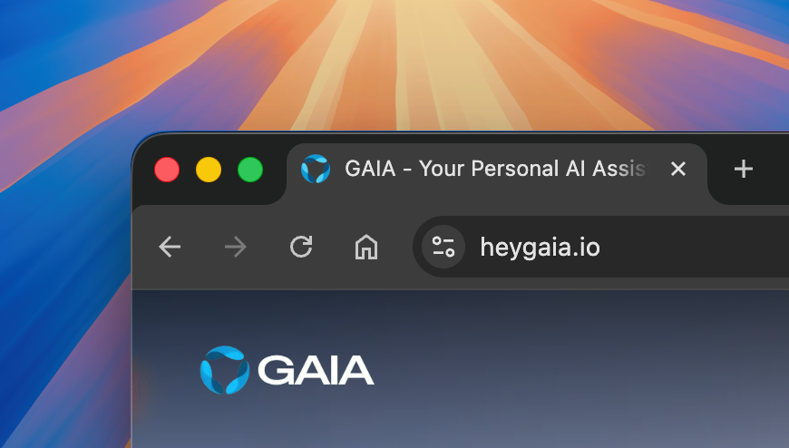
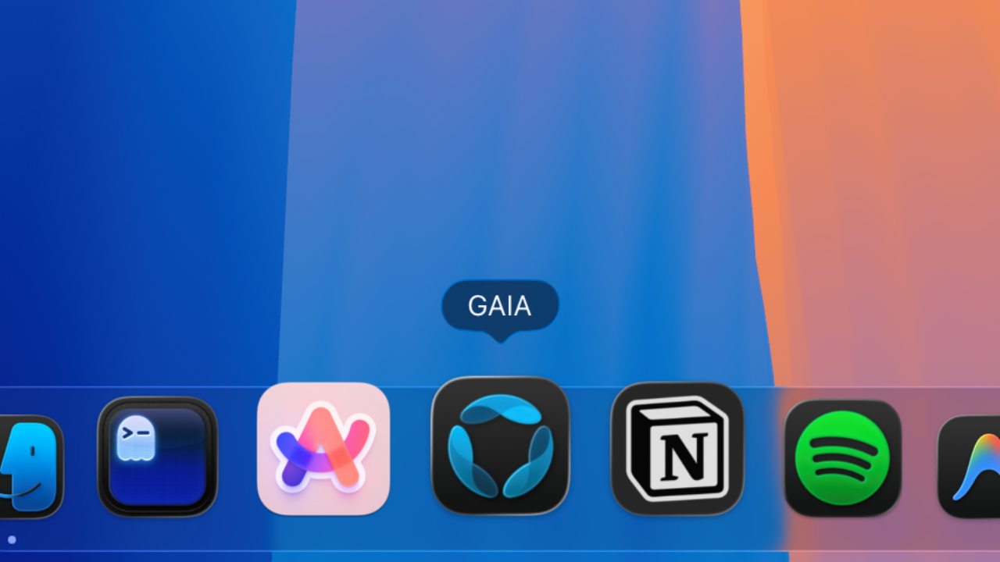

<div align="center">

# GAIA - Your Personal AI Assistant

<!--  -->


<br />
<br />

[](https://heygaia.io) [](https://docs.heygaia.io) 

[](https://uptime.betterstack.com/?utm_source=status_badge)  [](https://deepwiki.com/theexperiencecompany/gaia)

[](https://discord.heygaia.io) [](https://x.com/intent/user?screen_name=trygaia) [](https://whatsapp.heygaia.io) 
</div>

<b>[GAIA](https://heygaia.io)</b> is your proactive, personal AI assistant designed to increase your productivity.

It's designed to help users manage their digital lives by automating tasks, handling communication, and increasing productivity - going beyond traditional assistants like Siri, Google Assistant and ChatGPT.


## Table of Contents


- [GAIA - Your Personal AI Assistant](#gaia---your-personal-ai-assistant)
  - [Table of Contents](#table-of-contents)
  - [The Problem](#the-problem)
  - [Features](#features)
  - [Getting Started](#getting-started)
    - [**Cloud (zero setup):**](#cloud-zero-setup)
    - [**Self-host**](#self-host)
    - [**Develop or contribute:**](#develop-or-contribute)
  - [Chat with GAIA on Your Favorite Platforms](#chat-with-gaia-on-your-favorite-platforms)
  - [Monorepo Structure](#monorepo-structure)
  - [Documentation](#documentation)
  - [Community \& Support](#community--support)
  - [Contributing](#contributing)
  - [Tools We Love](#tools-we-love)
  - [License](#license)
  - [Contact](#contact)
  - [Star History](#star-history)

## The Problem

We all drown in tools. Gmail, Calendar, Todos, Docs, Slack, Linear, WhatsApp, and the list keeps growing. Every person has a different stack, but the problem is the same. Our days are filled with small repetitive actions. Every calendar event we create is a few minutes gone. Every mail you draft, every todo you try to complete, every email you read that is not useful and just bullshit adds up. Every little task and chore you do in the tools you use every day, just to maintain your digital life and keep everything structured and clean, is a burden. Most of this is not real work. It is maintenance. Each task feels small in isolation, but together they are mentally tolling. They pile up day after day, quietly draining focus and motivation.

Over time, inboxes get cluttered, todo lists rot, messages pile up, and important things slip through. This slow accumulation is what pushes people into jobs they hate, doing things they do not enjoy, not because the work itself is meaningless, but because their mental bandwidth is constantly consumed by noise. That is exactly how this started for us. We missed a time sensitive email because everything looked equally urgent and we were already mentally exhausted.

Automation should fix this, but it does not. Most tools are rigid, technical, and built for power users. Even with LLMs, the burden is still on the user. You have to explain context, explain your style, explain your preferences, again and again, even for simple tasks like sending an email. That is wasted effort. A personal assistant should already know you. It should understand how you write, what you care about, what you usually ignore, and how your day actually flows.

Our goal with Gaia is to remove this mental load entirely. One assistant that understands your entire digital life, remembers everything, and quietly handles the boring, repetitive work for you. Not reactive, but proactive. The real problem we are solving is time, energy, and cognitive overload. People should open one dashboard and instantly understand their day without thinking. Everything else should just happen.

## Features

- **Truly Proactive AI**: Doesn't wait for commands - acts ahead of time on your upcoming deadlines, important emails, and tasks
- **Automated Workflows**: Create multi-step workflows to eliminate repetitive tasks - from email triage to research to document creation
- **Smart Todo Management**: Your todos become mini-workflows - GAIA researches, drafts, and handles the work automatically
- **Unified Productivity Hub**: All your tasks, emails, calendar, and goals in one dashboard at a glance
- **Graph-Based Memory**: Builds a living knowledge graph of your work - tasks link to projects, meetings link to documents, everything connects
- **Integration Marketplace**: Choose from hundreds of integrations, built by us and the community, to connect GAIA with your favorite tools like Gmail, Slack, Notion, Linear, GitHub, and more!
- **Multi-Platform**: Web | Desktop - macOS, Windows, Linux  | Mobile
- **Messaging Platform Integrations**: Talk to GAIA on Discord, Slack, and Telegram
- **Open Source & Self-Hostable**: Full transparency with the ability to self-host on your own infrastructure
<!-- 
<div align="center">
  <table>
    <tr>
      <td width="50%">
      <center>
        
        GAIA on Desktop
         <a href="https://heygaia.io/download">
          
        </a>
      </center>
      </td>
      <td width="50%">
      <center>
  
      </center>
      </td>
    </tr>
  </table>
</div> -->

## Getting Started

### **Cloud (zero setup):**

<a href="https://heygaia.io">

</a>
<br/>

- Visit **[heygaia.io](https://heygaia.io)** to get started instantly.

### **Self-host**
- Install the CLI and run the setup wizard:

```
npm install -g @heygaia/cli@latest

gaia init
```

__OR__

```bash
curl -fsSL https://heygaia.io/install.sh | sh
gaia init
```

See the [Self-Hosting Guide](https://docs.heygaia.io/self-hosting/overview) for more.

### **Develop or contribute:**
- Follow the [Developer Docs](https://docs.heygaia.io/developers/development-setup).


## Chat with GAIA on Your Favorite Platforms

Use GAIA directly inside the tools you're already in!

|&emsp;&emsp;&emsp;&emsp; | Platform | How to Use |
|---|---|---|
| | **Discord** | [Add the bot](https://heygaia.io/discord-bot) or [join the server](https://discord.heygaia.io) — use `/gaia` or `@mention` GAIA in any channel |
|  | **Slack** | Install the Slack app in your workspace and use `/gaia` and other slash commands |
||  **Telegram** | [Message @heygaia_bot](https://t.me/heygaia_bot) and send messages or use `/gaia` commands |
<!-- ||  **WhatsApp** | Start a chat with the GAIA bot and send messages or use `/gaia` commands | -->

See the [Bot Integrations Guide](https://docs.heygaia.io/bots/overview) for setup and usage details.


## Monorepo Structure

This repository is a full-stack monorepo managed with [Nx](https://nx.dev).

```
gaia
├── apps
│   ├── web              → Next.js web app                  https://heygaia.io
│   ├── desktop          → Electron desktop app (beta)      https://heygaia.io/download
│   ├── mobile           → React Native mobile app (beta)   
│   ├── api              → FastAPI + LangGraph backend
│   ├── voice-agent      → Voice processing worker
│   └── bots
│       ├── discord      → Discord bot
│       ├── slack        → Slack bot
│       └── telegram     → Telegram bot
├── docs                 → Documentation Website            https://docs.heygaia.io
├── packages
│   ├── cli              → @heygaia/cli setup tool           https://heygaia.io/install.sh
│   └── gaia-ui          → @heygaia/ui (wrapper)             https://ui.heygaia.io
├── libs
│   └── shared
│       ├── py           → gaia-shared Python package (used by api, voice-agent, bots)
│       └── ts           → Shared TypeScript utilities
└── infra
    └── docker           → Docker Compose configs (dev + prod)
```

## Documentation

Our comprehensive documentation is available at [docs.heygaia.io](https://docs.heygaia.io):

- **[Quick Start](https://docs.heygaia.io/quick-start)** - Get up and running in minutes
- **[Bot Integrations](https://docs.heygaia.io/bots/overview)** - Use GAIA on Discord, Slack, and Telegram
- **[Self-Hosting](https://docs.heygaia.io/self-hosting/overview)** - Deploy GAIA on your infrastructure
- **[For Developers](https://docs.heygaia.io/developers/introduction)** - Contribute and extend GAIA

## Community & Support

Join our growing community of users and contributors:

-  &nbsp;**[Discord](https://discord.heygaia.io)** — Chat with the team and other users.
-  &nbsp;**[Twitter](https://twitter.com/trygaia)** — Get the latest news and updates.
-  &nbsp;**[WhatsApp](https://whatsapp.heygaia.io)** — Get direct support from our team.

## Contributing

<a href="https://github.com/theexperiencecompany/gaia/graphs/contributors">
  
</a>

We welcome contributions of all kinds, from bug fixes and new features to documentation and testing.

AI and vibe-coded PRs are welcome! Just say so in the PR description. 🤖

Please read our [Contributing Guidelines](https://docs.heygaia.io/developers/contributing) to get started.

## Tools We Love

GAIA is built on the shoulders of giants.

We rely heavily on open-source software and world-class developer tools. This page exists to credit the projects that make building GAIA possible and to support the open-source culture that drives real progress.

→ https://heygaia.io/thanks

## License

This project is licensed under the [Polyform Strict License 1.0.0](https://polyformproject.org/licenses/strict/1.0.0/).

> [!WARNING]
> This license allows noncommercial use only.

See the full license terms at [LICENSE.md](LICENSE.md).

## Contact

Feel free to contact the team at contact@heygaia.io or aryan@heygaia.io for any questions

## Star History

<a href="https://www.star-history.com/#theexperiencecompany/gaia&Date">
 <picture>
   <source media="(prefers-color-scheme: dark)" srcset="https://api.star-history.com/svg?repos=theexperiencecompany/gaia&type=Date&theme=dark" />
   <source media="(prefers-color-scheme: light)" srcset="https://api.star-history.com/svg?repos=theexperiencecompany/gaia&type=Date" />
   
 </picture>
</a>

---

  <center>

Made with ❤️ by
[![The Experience Company](https://img.shields.io/badge/The%20Experience%20Company-121212?logo=data:image/svg+xml;base64,PD94bWwgdmVyc2lvbj0iMS4wIiBlbmNvZGluZz0iVVRGLTgiPz4KPHN2ZyBpZD0iTGF5ZXJfMSIgZGF0YS1uYW1lPSJMYXllciAxIiB4bWxucz0iaHR0cDovL3d3dy53My5vcmcvMjAwMC9zdmciIHZpZXdCb3g9IjAgMCAyOTE3IDI1OTYuMjIiPgogIDxkZWZzPgogICAgPHN0eWxlPgogICAgICAuY2xzLTEgewogICAgICAgIGZpbGw6ICNmZmY7CiAgICAgIH0KICAgIDwvc3R5bGU+CiAgPC9kZWZzPgogIDxwYXRoIGNsYXNzPSJjbHMtMSIgZD0iTTE2MjIuNDQsMTE0MC44MmMtMTcxLjM2LDExNi43Ny0yMTQuNzcsMTM5Ljc0LTI1MC41MSwxOTEuMTktODguNzgsMTI3Ljc4LTk2LjE4LDI3MS45LTkyLjAxLDM1OS42NiwxLjM5LDI3OC44MS00LjY3LDU1MC4xNi0zLjI4LDgyOC45NiwzNDUuNjYtMTQ0LjQ4LDc3NS40OS0zOTcuMDgsMTExNy41LTgzOS45Myw2OC4xMS04OC4xOSw3NjQuMjktOTc0LjMyLDQzNC43Ni0xNDE0LjE0QzI2OTUuMDIsODcuODYsMjQ3Mi4xNyw5LjcxLDIyNTQuMTMsMS41NCwxMzI2Ljc5LTMzLjIsNDg3Ljc3LDUyNS40NywxNTEuOTUsMTExMi4yM2MtLjY0LDEuMTEtMS41NiwyLjczLTIuNzUsNC44Mi01Ni4zNSw5OS4zOS0yMjAuNzIsMzg5LjM2LTExMy44OSw1NDUuMjIsNTMuOTUsNzguNywxNTYuNzgsOTMuNjQsMTc2LjI5LDk2LjQ3LDExMi4zOCwxNi4zMywyMDUuNDUtMzUuNjEsMzE4LjQzLTEwMC45NywxNDguMjctODUuNzcsMjIyLjYzLTEyOC4yNSwyMjMuNjYtMTI4LjkzLDExMC44LTczLjAzLDI5Mi40NS0xMzYuMzUsNDY5LjU5LTI2OS43LjI5LS4yMi01LjQ1LDMuMjctMTYuMzMsOS43OS0xNi43NiwxMC4wNC0zMDguNjksMTE2LjYzLTM5Mi42OCwxNzUuMDYtMTM4LjQ4LDk2LjM0LTUxMC40LDE2Ny44LTU3NC44NSw0OS4zNC02OS44My0xMjguMzMsMTc5Ljg1LTQ1Ni4xOSwyNTguODQtNTYwLjgyLjgxLTEuMDcsNy42Ny0xMC4wNSwxNC40Ny0xOC44NSwzMDguMDItMzk3Ljg0LDcwNC4zNS01NTAuNjgsNzc1LjgzLTU3Ny4yLDM4NC44Mi0xNDIuNzksOTM4LjgxLTE5Ny4xMiwxMDIwLjExLTIxLjE5LDc0LjQ0LDE2MS4xLTE0Mi41OSw0MjAuNDMtMzIxLjkxLDU1OC42OCIvPgogIDxwYXRoIGNsYXNzPSJjbHMtMSIgZD0iTTcyNS4yNiwxNjEyLjcyYy0xMDUuMiw1NC45NC0xOTUuMTQsODguMDYtMjQ3LjQyLDEwNS42NS0xNzYuMDYsNTkuMjUtMjMxLjc3LDMxLjk2LTIzOC4xNCwxMS4xNS04LjU1LTI3LjkxLDE4NS40MS05Ny45NiwyMDkuOTItMTA3LjUxLDc0LjMyLTI4LjkzLDk5LjQ5LTM2Ljc3LDE2My41Ny02NS4wOCw0NS4zMi0yMC4wMiwxNDIuNC02Ni4xNSwyNDMuNTItMTQ0LjA1LDEwLjk1LTguNDMsMjAuMDctMTUuMzgsMzIuMjItMjUuOTIsNDAuMTEtMzQuNzcsOTAuNzItODEuMzksMTMyLjczLTE1OC4zNCwzNy44My02OS4yOSw0OS45My0xNjUuODMsNTQuMDUtMjUyLjUyLDQuMDktLjk5LDIuNjIsNy40MiwyLjk2LDExLjQ0LDcuMjYsODcuNDksMTQuODQsMjM4LjU2LDk3LjU3LDI0NS42OCw2MS42Miw1LjMxLDExMy4xNi0yNy42OSwxNjguNTQtNTMuNzcsMi4yMS0xLjA0LDcuNi00LjU5LDcuMzIsMS40Ny03Mi4wOCw0OC4wMS0xMjAuMzcsOTQuODEtMTQ5LjQ3LDEyNi40Ni0zOS4zOCw0Mi44Mi01Ny43Myw3My4yNi02OS4wMiw5NS4xOS01Ljk5LDExLjY0LTE2LjM5LDMyLjEtMjQuODIsNjAuMzctMjUuMzIsODQuOTgtMjkuMTIsMjI4LjQyLTI5LjEsMjM0LjkxLDAsMCwwLC4xNi0uMDQuMTctMS41Ni4yOS0yMy43OS0yMjQuNi04My45NC0yNDMuNzMtMTIuMjgtMy45MS0yNy44NS0uNzItMzEuNDkuNzUtMTQuMjEsNS43MS0xMTAuODIsOTAuNzYtMjM4Ljk3LDE1Ny42OFoiLz4KPC9zdmc+)](https://experience.heygaia.io)
  <a href="https://heygaia.io">heygaia.io</a> • <a href="https://docs.heygaia.io">Documentation</a> • <a href="https://heygaia.io/contact">Contact Us</a>
</center>
