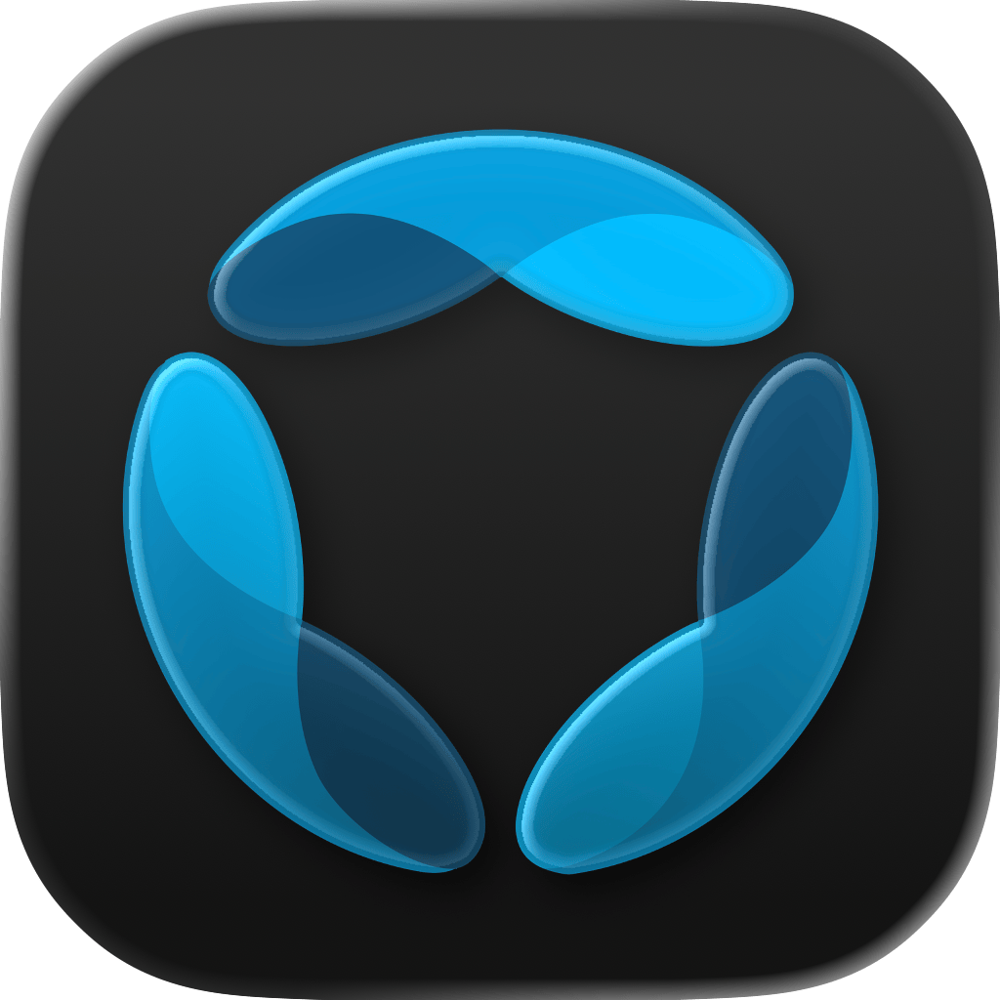

<div align="center">

# GAIA - Your Personal AI Assistant



<br />
<br />

[](https://heygaia.io) [](https://docs.heygaia.io) 

[](https://uptime.betterstack.com/?utm_source=status_badge)  [](https://deepwiki.com/theexperiencecompany/gaia)

[](https://discord.heygaia.io) [](https://x.com/intent/user?screen_name=trygaia) [](https://whatsapp.heygaia.io) 

</div>


**[GAIA](https://heygaia.io)** is your proactive, personal AI assistant designed to increase your productivity.

## Why GAIA?

We all drown in tools. Gmail, Calendar, Todos, Docs, Slack, Linear, WhatsApp — different stacks, same problem. Our days are eaten by small repetitive actions that are not real work. Each task feels small, but together they drain focus and energy. Over time inboxes clog, todo lists rot, and important things slip through.

Most automation doesn't fix this. Tools are rigid, built for power users, and still require you to explain your context every single time. A real personal assistant should already know you — how you write, what you care about, what you ignore. GAIA removes this mental load. One assistant that understands your entire digital life, remembers everything, and proactively handles the boring repetitive work so you can focus on what matters.

---

## Table of Contents

- [Features](#features)
- [Getting Started](#getting-started)
  - [Cloud (zero setup)](#cloud-zero-setup)
  - [Self-host or Develop](#self-host-or-develop)
- [Chat with GAIA on Your Favorite Platforms](#chat-with-gaia-on-your-favorite-platforms)
- [Tech Stack](#tech-stack)
- [Roadmap](#roadmap)
- [Monorepo Structure](#monorepo-structure)
- [Documentation](#documentation)
- [Community & Support](#community--support)
- [Contributing](#contributing)
- [Tools We Love](#tools-we-love)
- [License](#license)
- [Contact](#contact)
- [Star History](#star-history)

---

## Features

- **Truly Proactive AI**: Acts before you ask — deadlines, emails, tasks handled
- **Automated Workflows**: Eliminate repetitive work with multi-step automation
- **Smart Todo Management**: Todos that research, draft, and execute themselves
- **Unified Productivity Hub**: Tasks, email, calendar, and goals — one view
- **Graph-Based Memory**: Everything connected — tasks, projects, meetings, documents
- **Integration Marketplace**: Hundreds of integrations with Gmail, Slack, Notion, and more
- **Multi-Platform**: Web, Desktop (macOS, Windows, Linux), and Mobile
- **Message from anywhere**: Access GAIA on Discord, Slack, Telegram, and WhatsApp
- **Open Source & Self-Hostable**: Full transparency, runs on your own infrastructure

<br />

<div align="center">
  <table>
    <tr>
      <td align="center" width="50%">
        
        <br /><sub><b>Dashboard</b></sub>
      </td>
      <td align="center" width="50%">
        
        <br /><sub><b>Smart Todos</b></sub>
      </td>
    </tr>
    <tr>
      <td align="center" width="50%">
        
        <br /><sub><b>Calendar</b></sub>
      </td>
      <td align="center" width="50%">
        
        <br /><sub><b>Automated Workflows</b></sub>
      </td>
    </tr>
    <tr>
      <td align="center" width="50%">
        
        <br /><sub><b>Desktop App</b></sub>
      </td>
      <td align="center" width="50%">
        
        <br /><sub><b>Mobile App</b></sub>
      </td>
    </tr>
  </table>
</div>

## Getting Started

### Cloud (zero setup)

<a href="https://heygaia.io">
  
</a>

Visit **[heygaia.io](https://heygaia.io)** to get started instantly — no installation required.

### Self-host or Develop

<a href="https://heygaia.io/install">
  
</a>

**Prerequisites:** [Node.js](https://nodejs.org) 20+, one package manager (npm/pnpm/bun), [Docker](https://docs.docker.com/get-docker/)

Start with the CLI — it handles setup for both self-hosters and local dev:

```bash
npm install -g @heygaia/cli
# or
pnpm add -g @heygaia/cli
# or
bun add -g @heygaia/cli
gaia init
```

`gaia init` will ask whether you want a **production deployment** or a **local dev environment** and configure everything accordingly.

- Self-hosters → [Self-Hosting Guide](https://docs.heygaia.io/self-hosting/overview)
- Contributors → [Developer Setup](https://docs.heygaia.io/developers/development-setup)


## Chat with GAIA on Your Favorite Platforms

Use GAIA directly inside the tools you're already in!

|&emsp;&emsp;&emsp;&emsp; | Platform | How to Use |
|---|---|---|
| | **Discord** | [Add the bot](https://heygaia.io/discord-bot) or [join the server](https://discord.heygaia.io) — use `/gaia` or `@mention` GAIA in any channel |
|  | **Slack** | [Add GAIA to your workspace](https://heygaia.io/slack-bot) and use `/gaia` and other slash commands |
||  **Telegram** | [Message @heygaia_bot](https://t.me/heygaia_bot) and send messages or use `/gaia` commands |
||  **WhatsApp** | [Message GAIA](https://wa.me/12762088737) and send messages or use `/gaia` commands |

See the [Bot Integrations Guide](https://docs.heygaia.io/bots/overview) for setup and usage details.


## Tech Stack

GAIA is a full-stack Nx monorepo spanning web, desktop, mobile, backend, voice, and infrastructure.

| Layer | |
|---|---|
| **Web Frontend** |       |
| **Desktop** |  |
| **Mobile** |   |
| **Backend** |     |
| **AI / Agents** |    |
| **LLM Providers** |    |
| **Databases** |     |
| **Queue & Tasks** |   |
| **Voice & Real-time** |    |
| **Monitoring** |      |
| **Infrastructure** |     |
| **Tooling** |      |


## Roadmap

We track upcoming features, planned improvements, and in-progress work publicly.

**[View Roadmap](https://gaia.featurebase.app/roadmap)** · **[Submit a Feature Request](https://gaia.featurebase.app)**


## Monorepo Structure

This repository is a full-stack monorepo managed with [Nx](https://nx.dev).

```
gaia
├── apps
│   ├── web              → Next.js web app                  https://heygaia.io
│   ├── desktop          → Electron desktop app (beta)      https://heygaia.io/download
│   ├── mobile           → React Native mobile app (beta)   
│   ├── api              → FastAPI + LangGraph backend
│   ├── voice-agent      → Voice processing worker
│   └── bots
│       ├── discord      → Discord bot
│       ├── slack        → Slack bot
│       └── telegram     → Telegram bot
├── docs                 → Documentation Website            https://docs.heygaia.io
├── packages
│   ├── cli              → @heygaia/cli setup tool           npm install -g @heygaia/cli
│   └── gaia-ui          → @heygaia/ui (wrapper)             https://ui.heygaia.io
├── libs
│   └── shared
│       ├── py           → gaia-shared Python package (used by api, voice-agent, bots)
│       └── ts           → Shared TypeScript utilities
└── infra
    └── docker           → Docker Compose configs (dev + prod)
```

For a deeper look at how the pieces connect, see the [Architecture Overview](https://docs.heygaia.io/developers/introduction) in the docs.

## Documentation

Our comprehensive documentation is available at [docs.heygaia.io](https://docs.heygaia.io):

- **[Quick Start](https://docs.heygaia.io/quick-start)** - Get up and running in minutes
- **[Bot Integrations](https://docs.heygaia.io/bots/overview)** - Use GAIA on Discord, Slack, and Telegram
- **[Self-Hosting](https://docs.heygaia.io/self-hosting/overview)** - Deploy GAIA on your infrastructure
- **[For Developers](https://docs.heygaia.io/developers/introduction)** - Contribute and extend GAIA

## Community & Support

Join our growing community of users and contributors:

-  &nbsp;**[Discord](https://discord.heygaia.io)** — Chat with the team and other users.
-  &nbsp;**[Twitter](https://twitter.com/trygaia)** — Get the latest news and updates.
-  &nbsp;**[WhatsApp](https://whatsapp.heygaia.io)** — Get direct support from our team.

## Contributing

<a href="https://github.com/theexperiencecompany/gaia/graphs/contributors">
  
</a>

We welcome contributions of all kinds — bug fixes, features, docs, and tests.

> 🤖 **AI & vibe-coded PRs are welcome!** Built it with Claude, Cursor, or any AI tool? That's great — just mention it in the PR description.

**Where to start:**
- [Contributing Guidelines](https://docs.heygaia.io/developers/contributing) — how we work and what we're looking for
- [Development Setup](https://docs.heygaia.io/developers/development-setup) — get your local environment running
- [Code Style Guide](https://docs.heygaia.io/configuration/code-style) — linting, formatting, and conventions
- [Conventional Commits](https://docs.heygaia.io/configuration/conventional-commits) — commit message format
- [Pull Request Guide](https://docs.heygaia.io/configuration/pull-requests) — how to open a great PR

For bugs and feature requests, [open an issue](https://github.com/theexperiencecompany/gaia/issues).

## Tools We Love

GAIA is built on the shoulders of giants.

We rely heavily on open-source software and world-class developer tools. This page exists to credit the projects that make building GAIA possible and to support the open-source culture that drives real progress.

https://heygaia.io/thanks

## License

This project is licensed under the [Polyform Strict License 1.0.0](https://polyformproject.org/licenses/strict/1.0.0/).

> [!WARNING]
> This license allows noncommercial use only.

See the full license terms at [LICENSE.md](LICENSE.md).

## Contact

Feel free to contact the team at contact@heygaia.io or aryan@heygaia.io for any questions

## Star History

<a href="https://www.star-history.com/#theexperiencecompany/gaia&Date">
 <picture>
   <source media="(prefers-color-scheme: dark)" srcset="https://api.star-history.com/svg?repos=theexperiencecompany/gaia&type=Date&theme=dark" />
   <source media="(prefers-color-scheme: light)" srcset="https://api.star-history.com/svg?repos=theexperiencecompany/gaia&type=Date" />
   
 </picture>
</a>

---

  <center>

Made with ❤️ by
[![The Experience Company](https://img.shields.io/badge/The%20Experience%20Company-121212?logo=)](https://experience.heygaia.io)
  <a href="https://heygaia.io">heygaia.io</a> • <a href="https://docs.heygaia.io">Documentation</a> • <a href="https://heygaia.io/contact">Contact Us</a>
</center>
