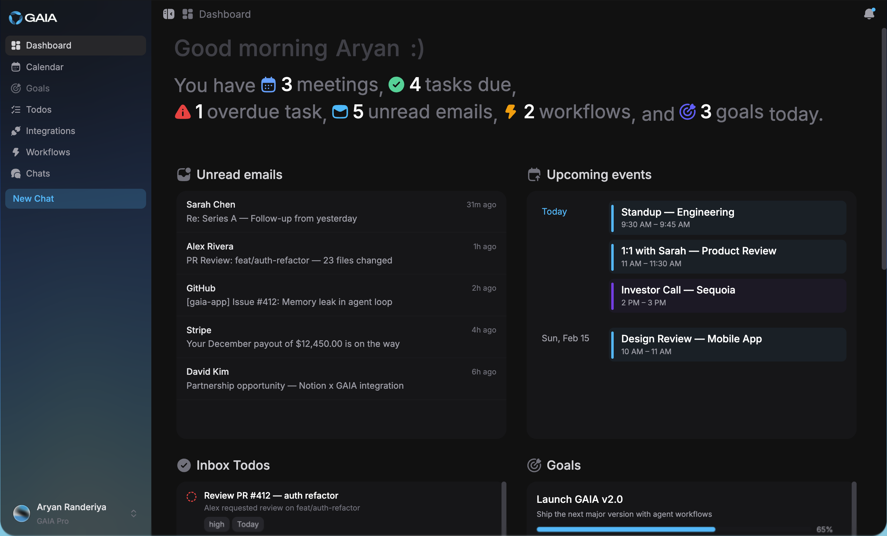
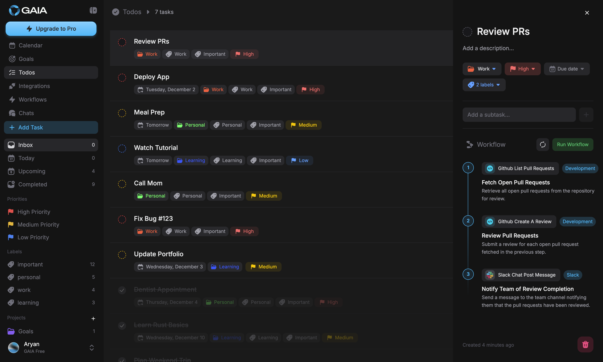
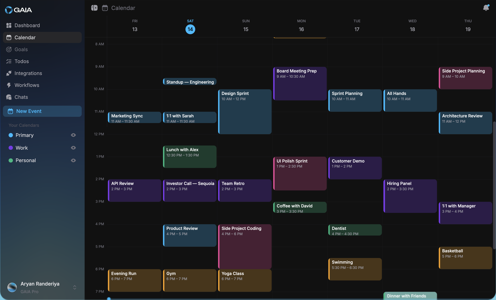
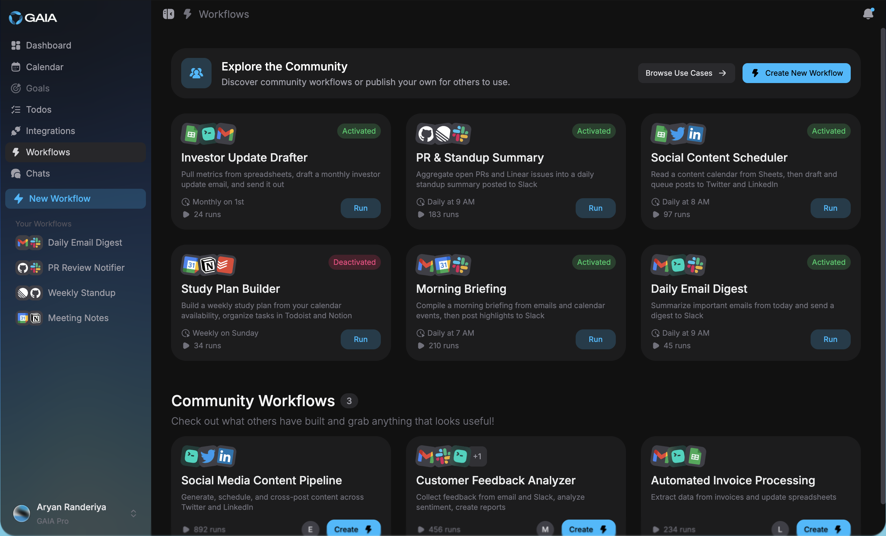
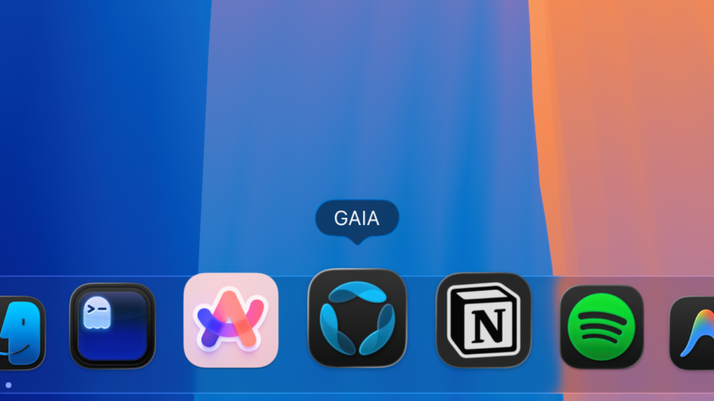
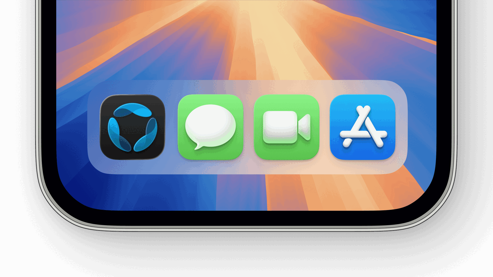
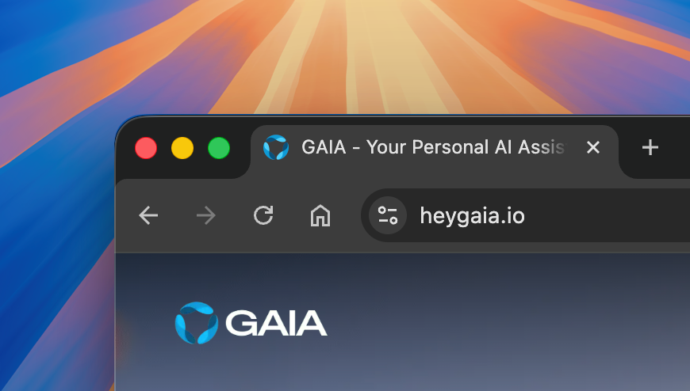
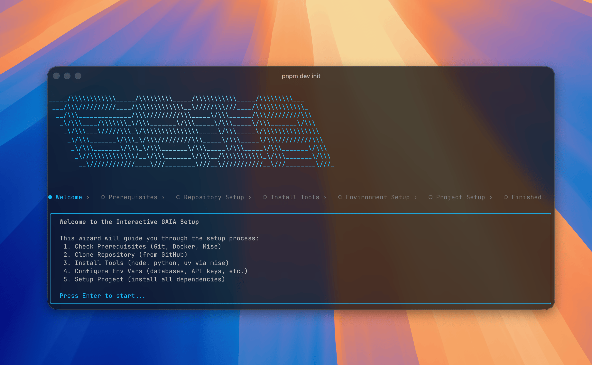
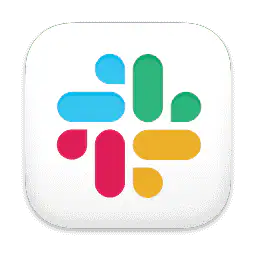

<div align="center">

# GAIA — Your Personal AI Assistant

[](https://heygaia.io) [](https://docs.heygaia.io) [](https://uptime.betterstack.com/?utm_source=status_badge)  [](https://deepwiki.com/theexperiencecompany/gaia)

[](https://discord.heygaia.io) [](https://x.com/intent/user?screen_name=trygaia) [](https://whatsapp.heygaia.io)

<br />

https://github.com/user-attachments/assets/19928409-9f05-413f-9ada-d501bc99bc67

</div>

**[GAIA](https://heygaia.io)** is the personal AI assistant that does the work you shouldn't be doing manually — email triage, meeting prep, cross-tool workflows, and everything that quietly eats your day.

<div align="center">

<a href="https://heygaia.io">

</a>

<a href="https://docs.heygaia.io/self-hosting/overview">

</a>

</div>

## Why GAIA?

We all drown in tools. Gmail, Calendar, Todos, Docs, Slack, Linear, WhatsApp — different stacks, same problem. Our days are eaten by small repetitive actions that are not real work. Each task feels small, but together they drain focus and energy. Over time inboxes clog, todo lists rot, and important things slip through.

Most automation doesn't fix this. Tools are rigid, built for power users, and ask you to explain your context every single time. A real personal assistant should already know you — how you write, who you work with, what you ignore. GAIA is that assistant. It remembers context across your tools, acts before you ask, and runs the repetitive work in the background while you do the real work.

---

## Table of Contents

- [Features](#features)
- [What you actually ask GAIA](#what-you-actually-ask-gaia)
- [Getting Started](#getting-started)
  - [Cloud (zero setup)](#cloud-zero-setup)
  - [Self-host or Develop](#self-host-or-develop)
- [Chat with GAIA on Your Favorite Platforms](#chat-with-gaia-on-your-favorite-platforms)
- [Tech Stack](#tech-stack)
- [Architecture](#architecture)
- [Roadmap](#roadmap)
- [Monorepo Structure](#monorepo-structure)
- [Documentation](#documentation)
- [FAQ](#faq)
- [Community & Support](#community--support)
- [Contributing](#contributing)
- [Tools We Love](#tools-we-love)
- [License](#license)
- [Contact](#contact)
- [Star History](#star-history)

---

## Features

An assistant, not a chatbot. The difference shows up in what each of these actually does.

- **Proactive** — Acts before you ask: handles deadlines, drafts replies, flags what matters, and watches events in the background
- **Workflows** — Multi-step automations across your tools, triggered on a schedule or by an event (new email, calendar change, webhook)
- **Smart todos** — Todos that research, draft, and execute themselves, not just reminders
- **Cross-tool memory** — Remembers the people, projects, and preferences that come up across conversations; ask once, it sticks
- **One view** — Tasks, email, calendar, and goals in one place, instead of five browser tabs
- **Integration catalogue** — Gmail, Calendar, Slack, Linear, Notion, and more — plus a community marketplace and custom MCP servers
- **Runs everywhere** — Web, Desktop (macOS, Windows, Linux), Mobile
- **Chat from anywhere** — Ping GAIA on Discord, Slack, Telegram, or WhatsApp — it arrives with your full context
- **Open source & self-hostable** — Full transparency, runs on your own infrastructure

<br />

<div align="center">
  <table>
    <tr>
      <td align="center" width="50%">
        
        <br /><sub><b>Dashboard</b></sub>
      </td>
      <td align="center" width="50%">
        
        <br /><sub><b>Smart Todos</b></sub>
      </td>
    </tr>
    <tr>
      <td align="center" width="50%">
        
        <br /><sub><b>Calendar</b></sub>
      </td>
      <td align="center" width="50%">
        
        <br /><sub><b>Automated Workflows</b></sub>
      </td>
    </tr>
    <tr>
      <td align="center" width="50%">
        
        <br /><sub><b>Desktop App</b></sub>
      </td>
      <td align="center" width="50%">
        
        <br /><sub><b>Mobile App</b></sub>
      </td>
    </tr>
  </table>
</div>

## What you actually ask GAIA

Real things people use GAIA for — not hypothetical features. Every example below works today.

- **"Summarize the 47 unread emails in my inbox and draft replies for the 3 that actually need one."** GAIA ranks by importance, reads threads end-to-end, and writes drafts in your voice.
- **"Pull my GitHub, Linear, and Slack activity from this week and post a Friday digest to #eng-updates."** Merged PRs, closed issues, channel highlights — gathered, formatted, posted.
- **"When my 2pm gets cancelled, rewrite my todo list to use the freed time."** GAIA watches calendar changes and replans the afternoon against your pending todos and goals.
- **"Before my 1:1 with Alex tomorrow, brief me on everything we've shipped this sprint."** Pulls related PRs, Linear issues, and Slack threads into a single prep doc.
- **"Turn this meeting transcript into action items, assign owners, and add them to Linear."** Extracts decisions, matches them to projects, creates issues with the right assignees.
- **"Watch my email for anything from [investor] and ping me on Telegram within 60 seconds."** Persistent background monitoring, cross-channel notification.
- **"Draft follow-ups to every email I sent more than 3 days ago that hasn't been replied to."** Inbox sweep plus a personalised follow-up draft per thread.
- **"Research these 10 companies and extract their pricing, team size, and funding round into a table."** Web research, structured output, pasted straight into Notion or Sheets.
- **"Every Monday at 9am, scan my calendar and prep a briefing for each meeting."** Scheduled workflow, per-meeting context assembly, waiting for you when you sit down.

## Getting Started

### Cloud (zero setup)

<a href="https://heygaia.io">
  
</a>

Visit **[heygaia.io](https://heygaia.io)** to get started instantly — no installation required.

### Self-host or Develop

<a href="https://heygaia.io/install">
  
</a>

**Prerequisites:** [Node.js](https://nodejs.org) 20+, one package manager (npm/pnpm/bun), [Docker](https://docs.docker.com/get-docker/)

Start with the CLI — it handles setup for both self-hosters and local dev:

```bash
npm install -g @heygaia/cli
# or
pnpm add -g @heygaia/cli
# or
bun add -g @heygaia/cli
gaia init
```

`gaia init` will ask whether you want a **production deployment** or a **local dev environment** and configure everything accordingly.

- Self-hosters → [Self-Hosting Guide](https://docs.heygaia.io/self-hosting/overview)
- Contributors → [Developer Setup](https://docs.heygaia.io/developers/development-setup)


## Chat with GAIA on Your Favorite Platforms

Use GAIA directly inside the tools you're already in.

|&emsp;&emsp;&emsp;&emsp; | Platform | How to Use |
|---|---|---|
| | **Discord** | [Add the bot](https://heygaia.io/discord-bot) or [join the server](https://discord.heygaia.io) — use `/gaia` or `@mention` GAIA in any channel |
|  | **Slack** | [Add GAIA to your workspace](https://heygaia.io/slack-bot) and use `/gaia` and other slash commands |
||  **Telegram** | [Message @heygaia_bot](https://t.me/heygaia_bot) and send messages or use `/gaia` commands |
||  **WhatsApp** | [Message GAIA](https://wa.me/12762088737) and send messages or use `/gaia` commands |

See the [Bot Integrations Guide](https://docs.heygaia.io/bots/overview) for setup and usage details.


## Tech Stack

GAIA is a full-stack Nx monorepo spanning web, desktop, mobile, backend, voice, and infrastructure.

| Layer | |
|---|---|
| **Web Frontend** |     ![Zustand](https://img.shields.io/badge/Zustand-433E38?style=flat&logo=&logoColor=white) |
| **Desktop** |   |
| **Mobile** |    |
| **Backend** |    |
| **AI / Agents** |        |
| **Databases** |     |
| **Queue & Tasks** |   |
| **Monitoring** |     |
| **Bots** |     |
| **Infrastructure** |     |
| **Tooling** |       |

## Roadmap

We track upcoming features, planned improvements, and in-progress work publicly.

**[View Roadmap](https://gaia.featurebase.app/roadmap)** · **[Submit a Feature Request](https://gaia.featurebase.app)**


## Monorepo Structure

This repository is a full-stack monorepo managed with [Nx](https://nx.dev).

```
gaia
├── apps
│   ├── web              → Next.js web app                  https://heygaia.io
│   ├── desktop          → Electron desktop app (beta)      https://heygaia.io/download
│   ├── mobile           → React Native mobile app (beta)   
│   ├── api              → FastAPI + LangGraph backend
│   ├── voice-agent      → Voice processing worker
│   └── bots
│       ├── discord      → Discord bot
│       ├── slack        → Slack bot
│       └── telegram     → Telegram bot
├── docs                 → Documentation Website            https://docs.heygaia.io
├── packages
│   ├── cli              → @heygaia/cli setup tool           npm install -g @heygaia/cli
│   └── gaia-ui          → @heygaia/ui (wrapper)             https://ui.heygaia.io
├── libs
│   ├── shared
│   │   ├── py           → gaia-shared Python package (used by api, voice-agent, bots)
│   │   └── ts           → Shared TypeScript utilities
│   └── wake-word        → @gaia/wake-word — cross-platform on-device "Hey GAIA" detection
│       │                  (122 KB ONNX, web + electron + react native, ~80 ms time-to-wake)
│       ├── src/core     → platform-agnostic detector + 3-stage openWakeWord pipeline
│       ├── src/web      → onnxruntime-web + AudioWorklet + React hook
│       ├── src/native   → onnxruntime-react-native + audio capture + RN hook
│       ├── models       → bundled ONNX artifacts (mel + embedding + VAD + classifier)
│       └── training     → Python pipeline: Piper TTS synthesis + LibriSpeech negatives + MPS training
└── infra
    └── docker           → Docker Compose configs (dev + prod)
```

For a deeper look at how the pieces connect, see the [Architecture Overview](https://docs.heygaia.io/developers/introduction) in the docs.

## Documentation

Our comprehensive documentation is available at [docs.heygaia.io](https://docs.heygaia.io):

- **[Quick Start](https://docs.heygaia.io/quick-start)** - Get up and running in minutes
- **[Bot Integrations](https://docs.heygaia.io/bots/overview)** - Use GAIA on Discord, Slack, and Telegram
- **[Self-Hosting](https://docs.heygaia.io/self-hosting/overview)** - Deploy GAIA on your infrastructure
- **[For Developers](https://docs.heygaia.io/developers/introduction)** - Contribute and extend GAIA

## FAQ

<details>
<summary><b>Cloud vs self-hosted — what's different for me as a user?</b></summary>

The interface is identical on both. Cloud is zero-setup at [heygaia.io](https://heygaia.io), free to start, with plan-based usage limits and managed infrastructure. Self-hosting gives you full data control, no usage caps, and the ability to swap models freely — in exchange for running the stack on your own machines and bringing your own API keys.

</details>

<details>
<summary><b>How do I connect a new integration?</b></summary>

Open <code>/integrations</code>. Browse by category (Productivity, Communication, Developer, and more) or search by name. Click **Connect** — for providers like Gmail, Calendar, Slack, Linear or Notion, you'll be redirected to their consent screen to grant the scopes GAIA needs; for API-key providers, a modal pops up where you paste the token. Once connected, the sidebar shows the tools that integration unlocks, and a **Disconnect** button revokes access in one click.

Need something that isn't in the catalogue? You can add your own MCP integration from the same page, connect it privately, or publish it to the community marketplace.

</details>

<details>
<summary><b>Does GAIA read my email?</b></summary>

Only the threads relevant to whatever you've asked it to do, and only with the scopes you granted on the provider's OAuth consent screen when you connected Gmail. Email content isn't mirrored into GAIA's database — it's fetched per request. You can disconnect the integration from <code>/integrations</code> at any time, which revokes access immediately.

</details>

<details>
<summary><b>What data does GAIA store about me, and can I delete it?</b></summary>

Yes, all of it is under your control:

- **Long-term memory** — everything GAIA has learned about you (people, projects, preferences) is visible on the **Memory** settings page as a list or interactive graph. Delete individual memories, or clear everything with one button. You can also export your memory graph as PNG or SVG.
- **Chat history** — the **Preferences** settings page has a one-click "Clear chat history".
- **Workflows, todos, and reminders** — all manageable from their respective pages.
- **Integration tokens** — stored encrypted, revoked immediately when you disconnect.

Integration content (email bodies, calendar events, documents) is not persisted — it's fetched on demand when a request needs it.

</details>

<details>
<summary><b>How does GAIA's "proactive" behaviour actually work?</b></summary>

Head to the <b>Workflows</b> page and build one. Two kinds of triggers today:

- **Scheduled** — cron-style ("every weekday at 9am", "first Monday of the month")
- **Event-driven** — new Gmail message, new calendar event, webhooks from Linear / Slack / GitHub / Todoist / Sheets / Docs

Chain steps across your integrations ("fetch → summarise → post to Slack") and GAIA will run the whole thing in the background, no prompt required. When a run produces something you should see — a drafted email, a new todo, a reminder, a suggested calendar event — it lands in the notifications bell in the header and on the <code>/notifications</code> page, where you can approve, edit or dismiss it.

</details>

<details>
<summary><b>Can I bring my own API keys?</b></summary>

On **self-hosted**, yes — provider keys (model providers, integration services) are configured via environment variables. On **cloud**, no — the platform manages models on your behalf and usage is governed by your plan. You can still pick between the available models from the chat composer; which ones are unlocked depends on your plan.

</details>

<details>
<summary><b>What does self-hosting cost to run?</b></summary>

The GAIA code is free under Polyform Strict (noncommercial use). Real costs are: model API usage (scales with how much you use it), any paid-tier integration services you opt into, and hosting — a single modestly-sized VM handles a small team. See the <a href="https://docs.heygaia.io/self-hosting/overview">self-hosting guide</a> for detailed numbers.

</details>

## Community & Support

Join our growing community of users and contributors:

-  &nbsp;**[Discord](https://discord.heygaia.io)** — Chat with the team and other users.
-  &nbsp;**[Twitter](https://twitter.com/trygaia)** — Get the latest news and updates.
-  &nbsp;**[WhatsApp](https://whatsapp.heygaia.io)** — Get direct support from our team.

## Contributing

<a href="https://github.com/theexperiencecompany/gaia/graphs/contributors">
  
</a>

We welcome contributions of all kinds — bug fixes, features, docs, and tests.

> 🤖 **AI & vibe-coded PRs are welcome!** Built it with Claude, Cursor, or any AI tool? That's great — just mention it in the PR description.

**Where to start:**
- [Contributing Guidelines](https://docs.heygaia.io/developers/contributing) — how we work and what we're looking for
- [Development Setup](https://docs.heygaia.io/developers/development-setup) — get your local environment running
- [Code Style Guide](https://docs.heygaia.io/configuration/code-style) — linting, formatting, and conventions
- [Conventional Commits](https://docs.heygaia.io/configuration/conventional-commits) — commit message format
- [Pull Request Guide](https://docs.heygaia.io/configuration/pull-requests) — how to open a great PR

For bugs and feature requests, [open an issue](https://github.com/theexperiencecompany/gaia/issues).

## Tools We Love

GAIA is built on the shoulders of giants — the language models, frameworks, and open-source projects that make this possible. Full credits at **[heygaia.io/thanks](https://heygaia.io/thanks)**.

## License

This project is licensed under the [Polyform Strict License 1.0.0](https://polyformproject.org/licenses/strict/1.0.0/).

> [!WARNING]
> This license allows noncommercial use only.

See the full license terms at [LICENSE.md](LICENSE.md).

## Contact

Feel free to contact the team at contact@heygaia.io or aryan@heygaia.io for any questions

## Star History

<a href="https://www.star-history.com/#theexperiencecompany/gaia&Date">
 <picture>
   <source media="(prefers-color-scheme: dark)" srcset="https://api.star-history.com/svg?repos=theexperiencecompany/gaia&type=Date&theme=dark" />
   <source media="(prefers-color-scheme: light)" srcset="https://api.star-history.com/svg?repos=theexperiencecompany/gaia&type=Date" />
   
 </picture>
</a>

---

  <center>

Made with ❤️ by
[![The Experience Company](https://img.shields.io/badge/The%20Experience%20Company-121212?logo=)](https://experience.heygaia.io)
  <a href="https://heygaia.io">heygaia.io</a> • <a href="https://docs.heygaia.io">Documentation</a> • <a href="https://heygaia.io/contact">Contact Us</a>
</center>
