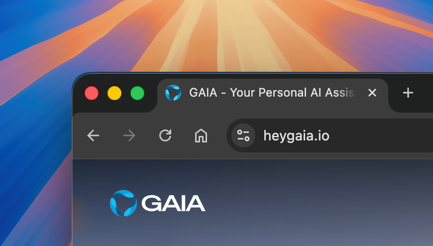
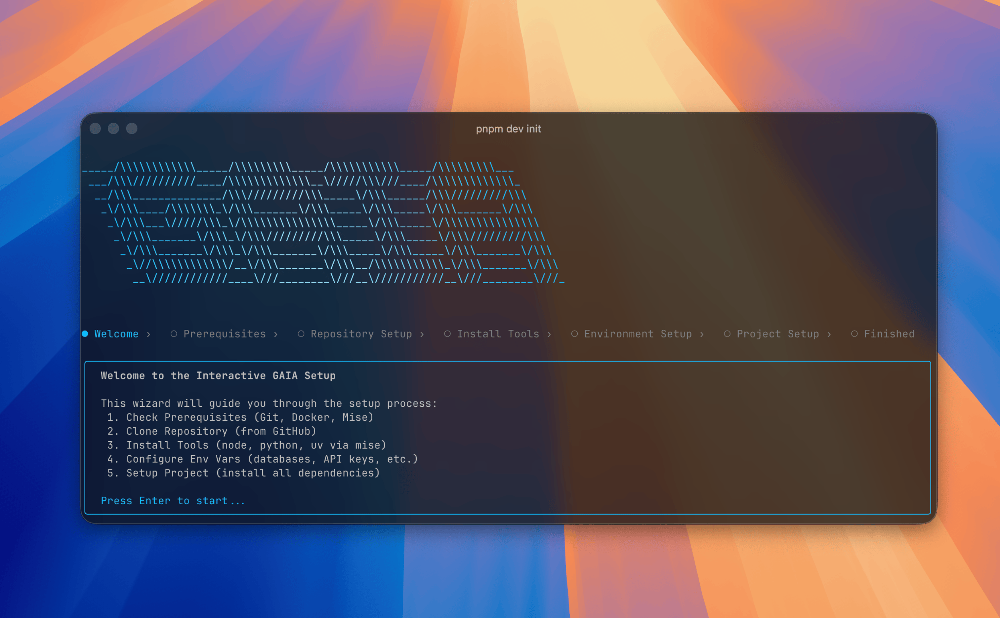

<div align="center">

# GAIA

**The open-source AI assistant that doesn't wait to be asked.**

[](https://docs.heygaia.io) [](https://discord.heygaia.io) [](https://whatsapp.heygaia.io) [](https://uptime.betterstack.com/?utm_source=status_badge) [](LICENSE.md)

<a href="https://heygaia.io"></a>
<a href="https://docs.heygaia.io/self-hosting/overview"></a>

</div>

Connect Gmail and GAIA triages your inbox every morning, drafts your replies and turns emails into todos. Connect your calendar and it briefs you before every meeting.

You set none of that up. It's running the moment you connect.

And when something needs you, it comes to you — on iMessage, WhatsApp, Telegram, Slack or Discord.

## Why GAIA

Your day is full of work that isn't your job — triaging mail, prepping for meetings, chasing updates, copying tasks between tools. Each one costs two minutes. Together they cost your afternoon.

**GAIA does that layer for you.** It does the work, then tells you when it's done.

## Features

- **Proactive** — connect a tool and jobs start running on their own, no setup
- **Workflows** — automations on a schedule or an event, written for you from plain English
- **Memory** — learns people, projects and preferences as you talk; edit, export or delete any of it
- **Voice** — real-time calls, plus a "Hey GAIA" wake word that runs [on your device](libs/wake-word)
- **Multi-platform** — iMessage, WhatsApp, Telegram, Slack, Discord, web, desktop and mobile, on one account
- **Integrations** — 32 services one click away, or anything with an MCP server
- **Code execution** — a sandboxed workspace that hands back real PDFs, decks and spreadsheets
- **Deep research** — multi-source web research with structured output
- **Skills** — 37 built in, on the open [Agent Skills spec](https://agentskills.io); install more from GitHub
- **One workspace** — inbox, calendar, todos and notifications in a single app
- **Self-hostable** — open source, your keys, your models, no caps

## Workflows

GAIA does the work before you ask, then tells you. A few workflows switch on by themselves the moment you connect a tool:

| Workflow | Turns on with | What it does |
| --- | --- | --- |
| **Inbox Triage** | Gmail | Every morning at 8, sorts the last day's mail, pulls out action items, creates the todos, and hands you one briefing |
| **Auto-Draft Replies** | Gmail | Spots mail that needs an answer and writes the reply. You approve before anything sends |
| **Meeting Briefing** | Calendar | Researches who you're meeting and what it's about, before you walk in |
| **Meeting Reminder** | Calendar | A heads-up 10 minutes out, join link included |

You'll never open a settings screen for those. Build your own from the **Workflows** page:

- **Describe it in plain English** — GAIA writes the steps for you
- **Run it on a schedule** — "every weekday at 9am"
- **Or on an event** — new email, calendar change, Slack message, GitHub commit, Linear issue, Notion edit, new row in a sheet
- **Chain steps across tools** — fetch, summarise, post to Slack

## Examples

Workflows run on their own. This is what you ask it directly.

- **"Summarise my 47 unread emails and draft replies for the 3 that need one."** Reads every thread end to end, ranks by what matters, drafts in your voice.
- **"Turn this call transcript into action items, assign owners and add them to Linear."** Pulls out the decisions, matches them to projects, files the issues.
- **"Draft follow-ups to every email I sent three days ago that nobody answered."** Sweeps your sent mail, writes a personalised nudge per thread.
- **"Research these 10 companies into a table with pricing, team size and funding."** Multi-source research, structured output, ready to paste.
- **"Clean up this CSV, chart the outliers and send me the deck."** Writes real Python, runs it in a real sandbox, hands back a real `.pptx`.
- **"Now run that every Monday at 9am."** Any of the above becomes a standing job, running on a schedule without you.

## Integrations

- **32 services, one click.** Gmail, Calendar, Slack, Notion, Linear, GitHub, Sheets, Todoist, Trello, HubSpot and more. Each gets its own specialist agent.
- **Anything else, via MCP.** [Model Context Protocol](https://modelcontextprotocol.io) is the open standard for plugging tools into AI models. Point GAIA at any MCP server and its tools work immediately — no fixed catalogue, no waiting on us.
- **A marketplace.** Browse what the community published, or publish your own.
- **Tools on your own computer.** `gaia bridge` links your laptop over one outgoing connection — nothing to forward, no ports to open.

```bash
gaia bridge login          # approve the pairing in your browser
gaia bridge fs ~/projects  # share a folder
gaia bridge up             # connect
```

## Platforms

| | Platform | How |
| --- | --- | --- |
|  | **iMessage** | [Register your number](https://heygaia.io/settings/linked-accounts), text `/auth`, then just type. [Pro plan](https://heygaia.io/pricing). |
|  | **WhatsApp** | [Message GAIA](https://wa.me/12762088737) |
|  | **Telegram** | [@heygaia_bot](https://t.me/heygaia_bot) — DMs, or `@mention` it in groups |
|  | **Slack** | [Add to your workspace](https://heygaia.io/slack-bot) |
|  | **Discord** | [Add the bot](https://heygaia.io/discord-bot) or [join the server](https://discord.heygaia.io) |

- Also on the **web**, a **[desktop app](https://heygaia.io/download)** for macOS, Windows and Linux, and **mobile**
- It's all one account — a chat you start on Telegram shows up in the web app
- Same memory everywhere, no matter where you talk to it

## Getting started

| If you want to… | Go here |
| --- | --- |
| Just use it | **[heygaia.io](https://heygaia.io)** — sign up, nothing to install |
| Text it from your phone | [iMessage](https://docs.heygaia.io/guides/imessage-bot) · [WhatsApp](https://wa.me/12762088737) · [Telegram](https://t.me/heygaia_bot) · [Slack](https://heygaia.io/slack-bot) · [Discord](https://heygaia.io/discord-bot) |
| Run it on your own machines | `npm i -g @heygaia/cli && gaia init` — or the [guide](https://docs.heygaia.io/self-hosting/overview) |
| Contribute | [Development Setup](https://docs.heygaia.io/developers/development-setup) |
| See how it's built | [ARCHITECTURE.md](./ARCHITECTURE.md) |

### Cloud — recommended

<a href="https://heygaia.io"></a>

Go to **[heygaia.io](https://heygaia.io)**. Free, nothing to install, always up to date.

This is how most people should use GAIA — you skip standing up Postgres, Mongo, Redis, ChromaDB and RabbitMQ yourself.

### Self-host — full control

<a href="https://heygaia.io/install"></a>

Prefer your own machines? You get your own keys and models, no caps, and your data on your disks — in exchange for running real infrastructure.

> [!IMPORTANT]
> The licence is **noncommercial**. Personal and non-profit self-hosting is free; running GAIA inside a business needs an [enterprise licence](https://heygaia.io/contact).

Needs [Docker](https://docs.docker.com/get-docker/) (Engine 20.10+, Compose v2+) and [Node.js](https://nodejs.org) 20+.

```bash
npm install -g @heygaia/cli
gaia init                     # choose "Self-Host (Docker)"
# → http://localhost:3000
```

That checks prerequisites, clones the repo, walks you through the environment variables, then builds and starts everything. After that:

```bash
gaia status   # health-check every service
gaia logs     # stream logs
gaia stop     # stop everything
gaia start    # bring it back up
```

Already cloned the repo? Run `gaia setup` inside it. Contributing? Choose **"Developer"** for hot-reload local dev.

Your ongoing cost is model API usage, not hosting — the [self-hosting guide](https://docs.heygaia.io/self-hosting/overview) has sizing and real numbers.

## Pricing

**$1 a day to never do busywork again.**

| Plan | Cost | What you get |
| --- | --- | --- |
| **Free** | $0, forever | Every tool and integration, standard models, a daily usage allowance, 50 saved memories |
| **Pro** | **$30/month** | Much higher limits, unlimited memories, more powerful models, long-running tasks, priority support, early access to new features |
| **Enterprise** | [Talk to us](https://heygaia.io/contact) | SSO, SCIM and audit logs, custom integrations, self-host or private cloud, a dedicated engineer and an SLA |

- Pay yearly and two months are free
- **Self-hosting is free** — you cover your own model API costs instead
- Full details on the [pricing page](https://heygaia.io/pricing)

## Security

GAIA touches your email, your calendar and your files, so we take reports seriously.

Found a vulnerability? Email **security@heygaia.io** — please don't open a public issue. Our full policy is in [SECURITY.md](.github/SECURITY.md).

## FAQ

<details>
<summary><b>What does GAIA store about me, and does it read my email?</b></summary>

Your actual content is never copied into GAIA's database. Email bodies, calendar events and documents are fetched when a request needs them, used, and not kept. GAIA only touches threads relevant to what you asked for, within the scopes you granted on the provider's consent screen.

What *is* stored is under your control:

- **Memory** — everything on the Memory page as a list or graph. Delete items or clear it all. Export as PNG or SVG.
- **Chat history** — one-click clear in Preferences.
- **Workflows, todos, reminders** — managed from their own pages.
- **Integration tokens** — encrypted, and revoked the moment you disconnect from `/integrations`.

</details>

<details>
<summary><b>Can I use my own API keys and models?</b></summary>

**Self-hosted:** yes. Providers are set via environment variables and the model catalogue is database-driven, so you can swap freely.

**Cloud:** no — models are managed for you and usage follows your plan. You can still pick between the available models in the composer.

</details>

<details>
<summary><b>How do I add an integration that isn't in the list?</b></summary>

Add it as an MCP server from `/integrations`. Paste the server URL, connect it privately, and its tools are available right away. You can publish it to the community marketplace if you want to share it.

For tools running on your own machine, use `gaia bridge` instead.

</details>

<details>
<summary><b>What does self-hosting cost?</b></summary>

The code is free under PolyForm Noncommercial, so you pay for model API usage, any paid integrations you opt into, and hosting. See [Self-host](#self-host) above for sizing.

</details>

## Documentation

**[docs.heygaia.io](https://docs.heygaia.io)** — [Quick Start](https://docs.heygaia.io/quick-start) · [Bots](https://docs.heygaia.io/bots/overview) · [Self-Hosting](https://docs.heygaia.io/self-hosting/overview) · [Developers](https://docs.heygaia.io/developers/introduction)

## Repository

Full-stack Nx monorepo.

```
apps
├── web            Next.js web app                    heygaia.io
├── desktop        Electron desktop app (beta)
├── mobile         React Native mobile app (beta)
├── api            FastAPI + LangGraph backend
├── voice-agent    LiveKit voice worker
├── bridge         gaia bridge — local file/tool tunnel
└── bots           imessage · whatsapp · telegram · slack · discord
packages
├── cli            @heygaia/cli
└── gaia-ui        @heygaia/ui
libs
├── shared/py      gaia-shared
├── shared/ts      shared TypeScript + the unified bot framework
└── wake-word      @gaia/wake-word — on-device "Hey GAIA"
docs               docs.heygaia.io
infra/docker       Docker Compose (dev + prod)
```

<details>
<summary><b>How the agent system works</b></summary>

<br />

GAIA runs three tiers of agents. The one you talk to never does the work itself — it hands off, so the conversation stays responsive while long jobs run in the background.

```
  Comms agent        Talks to you and narrates progress. Deliberately
      │              cannot do work — it can only delegate.
      ▼  call_executor(task)   →  returns instantly, runs in background
  Executor agent     The worker. Shell, files, research, planning, todos,
      │              and the handoff tool.
      ▼  handoff(subagent, task)
  Subagents          One specialist per integration, dispatched in parallel,
                     each scoped to only its own tools.
```

Why bother: a single agent holding 30 integrations' worth of tools picks the wrong one and gets slower with every tool you add. Scoping each integration to its own agent keeps tool choice accurate, and running them in parallel keeps it fast.

Every service and file path is mapped in **[ARCHITECTURE.md](./ARCHITECTURE.md)**.

</details>

## Contributing

<a href="https://github.com/theexperiencecompany/gaia/graphs/contributors">
  
</a>

Bug fixes, features, docs, tests — all welcome.

> 🤖 **AI and vibe-coded PRs are welcome.** Built it with Claude, Cursor, or anything else? Great — just say so in the PR description.

[Contributing Guidelines](https://docs.heygaia.io/developers/contributing) · [Development Setup](https://docs.heygaia.io/developers/development-setup) · [Code Style](https://docs.heygaia.io/configuration/code-style) · [Conventional Commits](https://docs.heygaia.io/configuration/conventional-commits) · [Pull Requests](https://docs.heygaia.io/configuration/pull-requests)

Found a bug? [Open an issue](https://github.com/theexperiencecompany/gaia/issues).

## Community

- **[Discord](https://discord.heygaia.io)** — chat with the team and other users
- **[Twitter](https://twitter.com/trygaia)** — news and updates
- **[WhatsApp](https://whatsapp.heygaia.io)** — direct support from our team

## Roadmap

We build in the open. **[View the roadmap](https://gaia.featurebase.app/roadmap)** · **[Request a feature](https://gaia.featurebase.app)**

## License

[PolyForm Noncommercial License 1.0.0](https://polyformproject.org/licenses/noncommercial/1.0.0/) — see [LICENSE.md](LICENSE.md).

> [!WARNING]
> This license allows noncommercial use only.

GAIA is built on the shoulders of giants. Full credits at **[heygaia.io/thanks](https://heygaia.io/thanks)**.

---

<div align="center">

If GAIA saves you an hour this week, a ⭐ helps someone else find it.

<a href="https://www.star-history.com/#theexperiencecompany/gaia&Date">
 <picture>
   <source media="(prefers-color-scheme: dark)" srcset="https://api.star-history.com/svg?repos=theexperiencecompany/gaia&type=Date&theme=dark" />
   <source media="(prefers-color-scheme: light)" srcset="https://api.star-history.com/svg?repos=theexperiencecompany/gaia&type=Date" />
   
 </picture>
</a>

<br /><br />

Made with ❤️ by [The Experience Company](https://experience.heygaia.io)

[heygaia.io](https://heygaia.io) • [Documentation](https://docs.heygaia.io) • [Contact](https://heygaia.io/contact) • contact@heygaia.io

</div>
