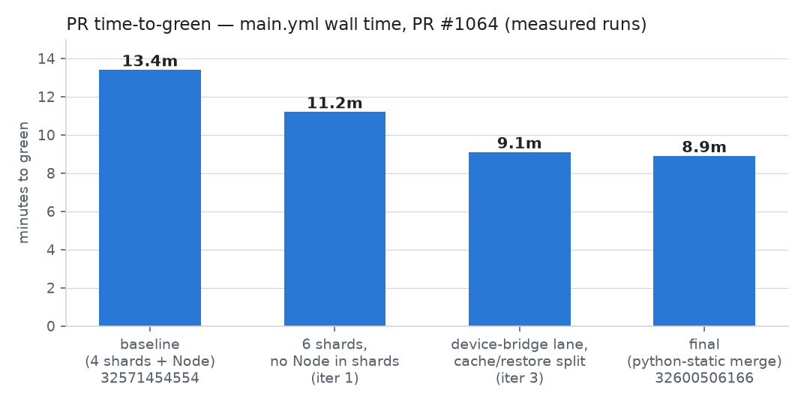
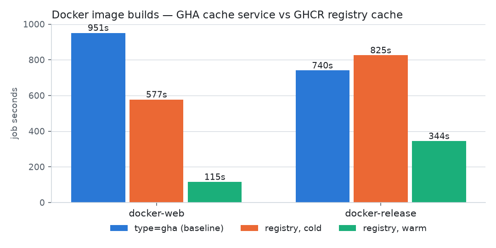

# CI Metrics — Before → After (PR #1064)

Every number below is a real GitHub Actions run, cited by run id. Regenerate the
charts with `uv run --with matplotlib --no-project python docs/ci-metrics/generate.py`
after re-measuring (the data lives inline in `generate.py`).

## PR time-to-green (main.yml wall, the required gate)

| Config | Wall | Run |
|---|---|---|
| Baseline: 4 shards, Node installed in every python job | 13.4m | 32571454554 |
| 6 shards, `install-node: false` in shards/coverage | 11.2m | iter 1 |
| device-bridge in its own Node lane, `cache/restore` split (no post-save re-upload) | 9.1m | iter 3 |
| Final: + python-static merge, build nx-cache save master-only | **8.9m** | 32600506166 |
| Final, second sample | 8.4m | 32599901671 |

code-quality.yml (parallel, not the gate tail): ~4m → **3m26s–3m38s** (runs
32600505939, 32599901385) after merging the four uv python lanes into one
`python-static` job (−3 runners/PR).

The remaining ~8.5m floor is load-bearing: detect 60s → slowest pytest shard
~270s (210s of it is pytest itself) → coverage combine + schemathesis ~104s →
gate. Further cuts are test-suite work, not CI work.

## Docker image builds — GHCR registry cache replaces the GHA cache service

The "~450s GHCR push" in earlier notes was mislabeled: buildx logs show the
actual GHCR image push is 36–40s; the 449s was the `cache-to: type=gha,mode=max`
export (the GHA cache API writes large layers at ~10MB/s). Moving the layer
cache to GHCR (`<repo>:buildcache`, `mode=max`, zstd) removes it:

| Job | type=gha (32599902431) | registry cold (32603173594) | registry warm (32604043926) |
|---|---|---|---|
| docker-web | 951s (cache export 449s) | 577s (export 95s) | **115s** |
| docker-release | 740s | 825s | **344s** |
| docker-grafana | 32–57s | 27s | 37s |

A real master push lands between cold and warm (dependency layers warm, source
and build layers rebuild); the 449s export cost is gone in every case.

## Master merge→deploy (estimate until first post-merge run)

Pre-branch success-only master wall: ~21.7m (gate green at ~10.5m, then the
serial docker + deploy phase). With the phase split, images build in parallel
with the gate, so the expected wall is gate (~10m) ∥ docker (≤ 825s cold) plus
the deploy phase (~2–3m) ≈ **13–14m**. The phase wiring has never executed on
master — verify on the first post-merge run before quoting these numbers.
