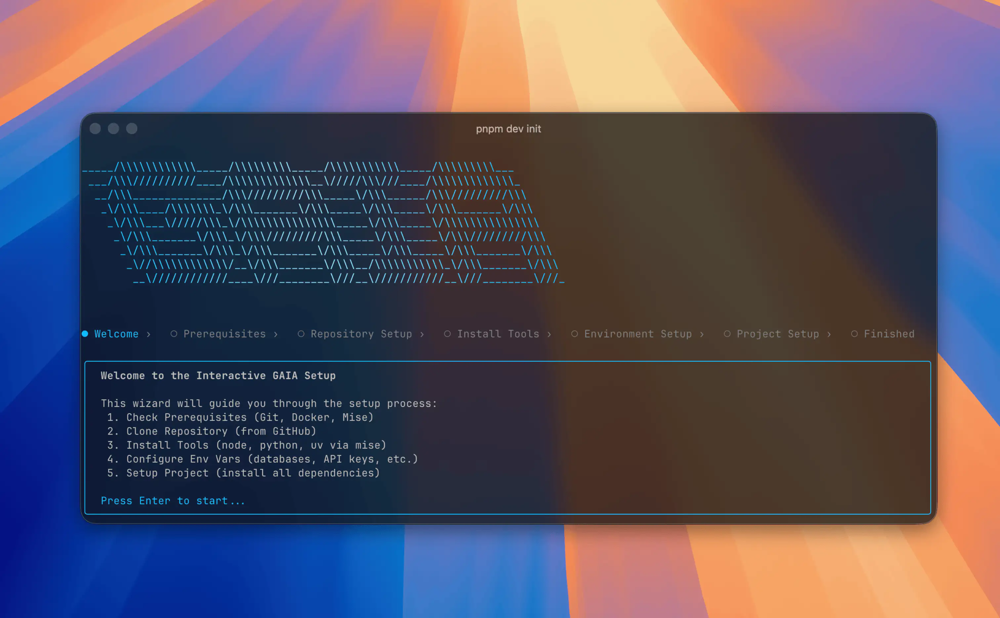

## Install the CLI

The GAIA CLI (`@heygaia/cli`) is a terminal-based tool for setting up, configuring, and managing GAIA instances.

Install globally with your package manager:

<CodeGroup>

```bash npm
npm install -g @heygaia/cli
```

```bash pnpm
pnpm add -g @heygaia/cli
```

```bash bun
bun add -g @heygaia/cli
```

</CodeGroup>

## Verify Installation

```bash
gaia --version
gaia --help
```

<Tip>
If `gaia` is not available immediately, open a new terminal session and run `gaia --help` again.
</Tip>

## Requirements

- **macOS, Linux, or Windows (WSL2 recommended)**
- **Node.js 20+** and one package manager (**npm**, **pnpm**, or **bun**)
- **Docker** installed and running
- **Git** installed

The CLI checks prerequisites during setup and guides you if something is missing.

## Upgrading

### Updating GAIA

Pull the latest changes from your GAIA repo directory:

```bash
cd /path/to/gaia
git pull
```

<Tip>
If the update includes dependency changes, run `gaia setup` afterwards.
</Tip>

### Updating the CLI

<CodeGroup>

```bash npm
npm install -g @heygaia/cli
```

```bash pnpm
pnpm add -g @heygaia/cli
```

```bash bun
bun add -g @heygaia/cli
```

</CodeGroup>

## Uninstalling

To fully remove GAIA from your machine:

1. Stop all running services:

```bash
gaia stop
```

2. Delete the GAIA repository directory:

```bash
rm -rf /path/to/gaia
```

3. Remove CLI metadata:

```bash
rm -rf ~/.gaia
```

4. Uninstall the CLI:

<CodeGroup>

```bash npm
npm uninstall -g @heygaia/cli
```

```bash pnpm
pnpm remove -g @heygaia/cli
```

```bash bun
bun remove -g @heygaia/cli
```

</CodeGroup>

## Next Steps

<CardGroup cols={2}>
  <Card title="Commands Reference" icon="terminal" href="/cli/commands">
    See all available CLI commands
  </Card>
  <Card title="First-Time Setup" icon="rocket" href="/self-hosting/cli-setup">
    Set up GAIA from scratch using the CLI wizard
  </Card>
</CardGroup>
