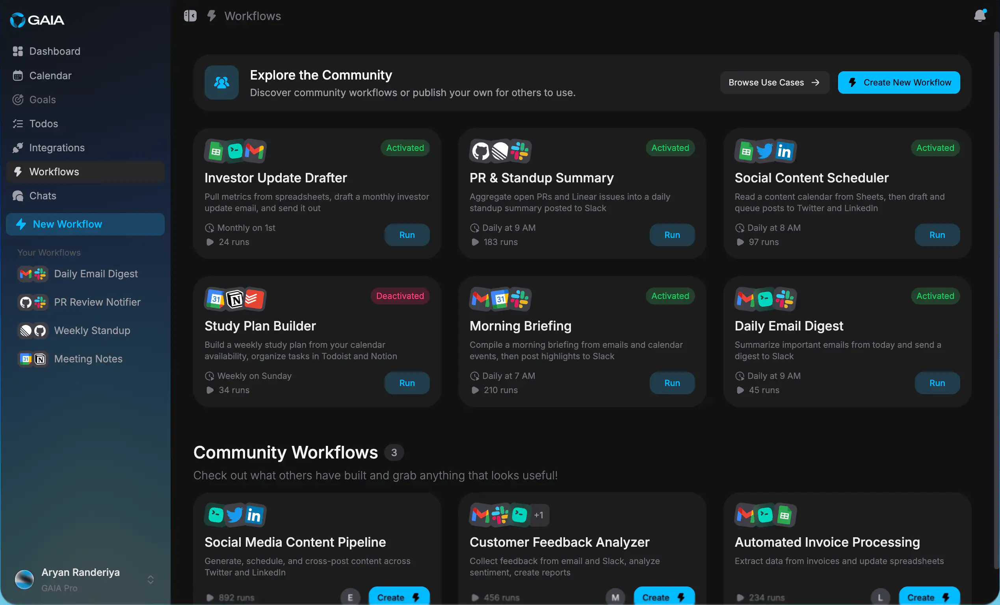
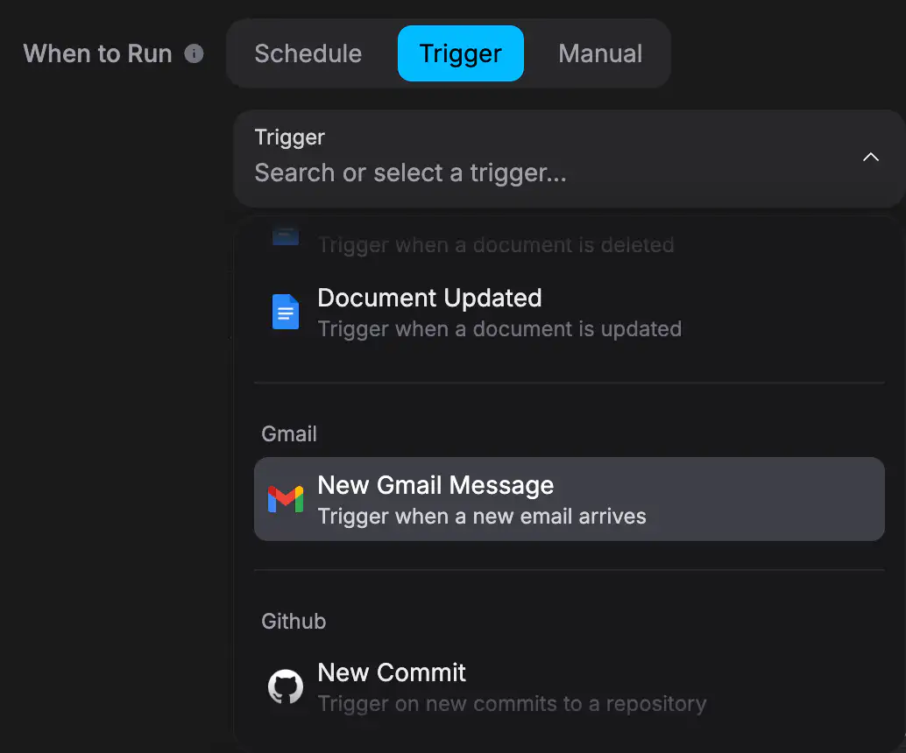
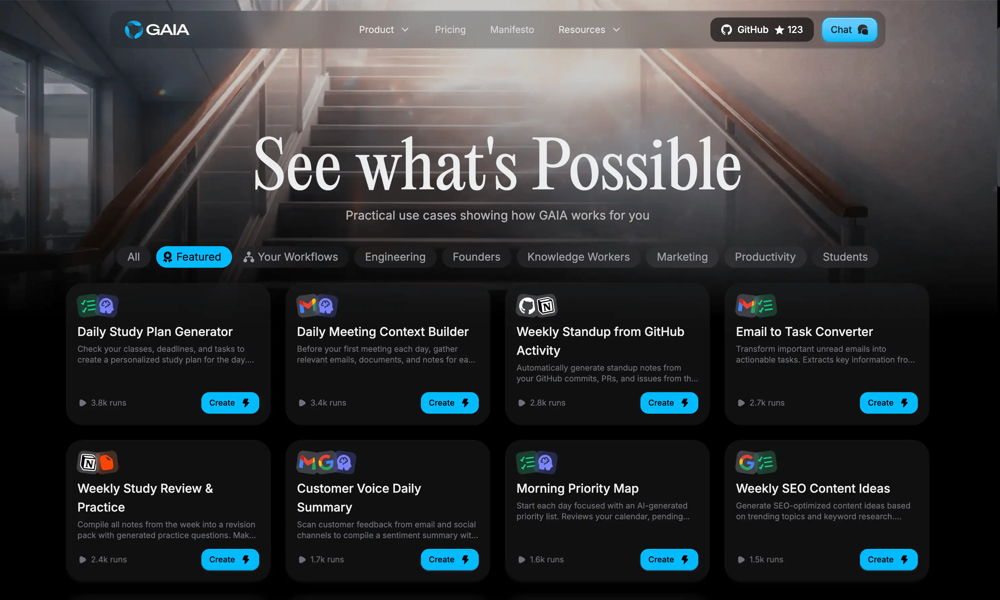

## What are workflows?

Workflows are sequences of steps that run automatically when something happens. You describe what you want in plain language, and GAIA figures out the steps.

For example: "When a GitHub issue is labeled 'urgent', create a task in Todoist and send me a Slack message." That's a workflow. You write it like that, and GAIA handles the rest.

Each workflow has two parts: a **trigger** (what starts it) and **actions** (what happens next). You can chain as many actions together as you need.

## Trigger types

<CardGroup cols={1}>
  <Card title="Manual" icon="hand-pointer">
    Run the workflow yourself, on demand. Useful for tasks you do regularly but
    not on a fixed schedule — like generating a report before a meeting.
  </Card>
  <Card title="Scheduled" icon="clock">
    Runs automatically on a cron schedule. Every Monday at 9am. Last day of the
    month. Every 30 minutes. If you can express it as a schedule, GAIA can run
    it.
  </Card>
  <Card title="Integration" icon="plug">
    Triggered by an event in a connected app — a new email, a merged PR, a
    calendar event starting. GAIA watches for the event and fires the workflow
    when it happens.
  </Card>
</CardGroup>

## Supported integration triggers

These are the apps you can use as triggers today:

- Google Calendar
- Gmail
- Notion
- Google Sheets
- GitHub
- Linear
- Slack
- Todoist
- Asana
- Google Docs

<Note>
  You need to connect an app before you can use it as a trigger. Go to
  **Integrations** in your settings to authorize each one.
</Note>

## Examples

Here are a few things you can build:

**Bug triage**
When a new GitHub issue is labeled `urgent`, create a task in Todoist with the issue title and link, then send a Slack message to `#engineering`.

**Weekly recap**
Every Friday at 4pm, pull completed tasks from Asana, summarize them, and add the summary to a Google Doc.

**Meeting prep**
30 minutes before any Google Calendar event with more than 2 attendees, search Gmail for recent threads with those people and surface a summary.

<Tip>
  Start simple. A one-trigger, one-action workflow is easier to debug than a
  five-step chain. Add more actions once you've confirmed the basics work.
</Tip>

## The marketplace

You can publish any workflow you've built so other GAIA users can find and use it. It's a good way to share useful automations you've built for yourself — someone else probably has the same problem.

You can also browse workflows the community has already built. If you find one that fits, you can add it to your account and customize it from there.

See the [publishing guide](/guides/create-public-workflow) for step-by-step instructions on how to share your workflows.
