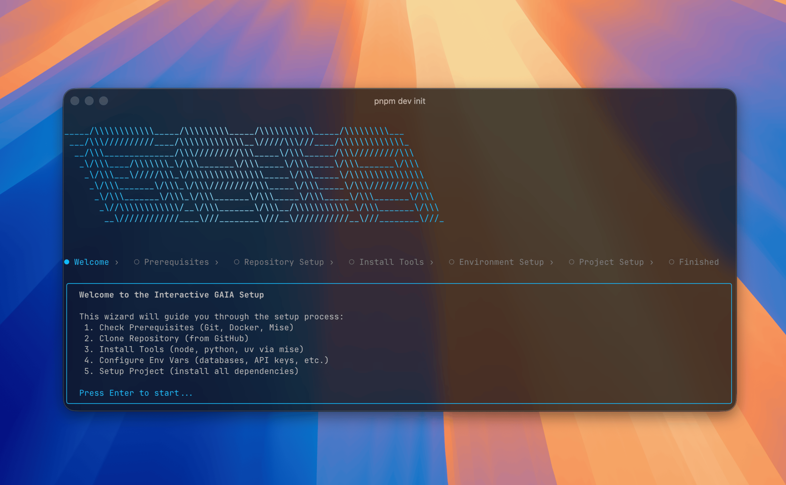

# @heygaia/cli



CLI tool for setting up and managing [GAIA](https://heygaia.io).

## Requirements

- **Node.js 20+** and one package manager (npm, pnpm, or bun)
- **macOS or Linux** (Windows via WSL2)
- **Docker** installed and running
- **Git** installed

The CLI checks prerequisites at startup and reports what is missing.

## Installation

Install globally with your preferred package manager:

```bash
npm install -g @heygaia/cli
pnpm add -g @heygaia/cli
bun add -g @heygaia/cli
```

## Commands

```bash
gaia init          # Full setup from scratch
gaia setup         # Configure existing repo
gaia start         # Start services in self-host mode
gaia dev           # Developer mode (Nx TUI)
gaia dev full      # Developer mode + workers (Nx TUI)
gaia logs          # Stream running logs
gaia stop          # Stop all services
gaia status        # Check service health
gaia --version     # Show CLI version
gaia --help        # Show all commands
```

### `gaia init`

Interactive first-time setup.

| Flag | Description |
|------|-------------|
| `--branch <name>` | Clone a specific branch |

### `gaia setup`

Reconfigure an existing GAIA repo:

```bash
cd /path/to/gaia
gaia setup
```

### `gaia start`

Starts services for **self-host mode**.

```bash
gaia start
```

Optional flags:

- `--build` rebuild Docker images before starting
- `--pull` pull latest base images before starting

### `gaia dev` / `gaia dev full`

Runs developer mode in foreground Nx TUI:

- `gaia dev` -> `mise dev`
- `gaia dev full` -> `mise dev:full`

### `gaia logs`

Streams logs for currently running services.

### `gaia stop`

Stops running GAIA services.

### `gaia status`

Shows health and latency for core services.

## Setup Modes

- **Self-Host (Docker)** — everything in Docker
- **Developer (Local)** — infra in Docker, app in local Nx TUI

## Port Overrides

When port conflicts are detected, overrides are written to `infra/docker/.env`.

## Development

```bash
# Build
cd packages/cli && pnpm run build

# Test the built CLI
./packages/cli/dist/index.js --help

# Run the test script
./packages/cli/test-cli.sh
```

## Publishing

1. Update version in `package.json`
2. Build: `pnpm run build`
3. Commit and tag: `git tag cli-v<version>`
4. Push tag — GitHub Actions publishes to npm

## License

MIT
